# RegVelo 真实图件画廊 / Executed gallery

全部预览来自697细胞的官方斑马鱼案例。PASS表示真实计算与渲染校验通过；模型预测仍需独立生物学验证。
PNG仅为压缩预览；本地独立结果保留原300 dpi PNG、SVG、PDF及完整AnnData。

输入来源、数据SHA256和参数见[来源清单](../OFFICIAL_SOURCE_MANIFEST.csv)、[案例](../examples/official_zebrafish/README.md)、[模型QC](../MODEL_QC_REPORT.md)。

```powershell
python scripts/regvelo.py visualize --config config/official_zebrafish.json
```

以上从模块目录、使用隔离环境执行；先完成相应数值阶段。每图source CSV是实际绘图数值。

## A01 Cell Type UMAP / 细胞类型UMAP

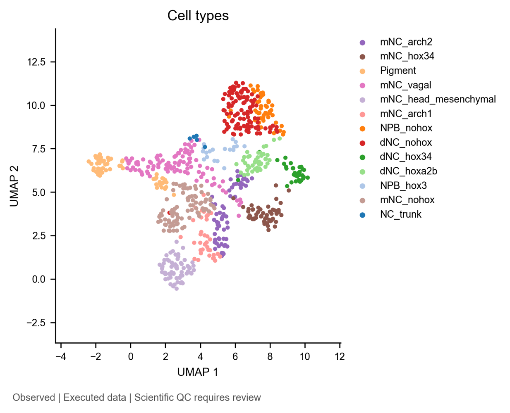

**状态：PASS；证据：Observed。** 展示已有细胞类型标签在UMAP上的位置；聚集位置不证明精细亚群身份或动力学方向。

科学问题：Which annotated cell classes are present? 输入：`C:\Users\13683\Documents\Codex\2026-10-10\files-pasted-by-the-user-codex\outputs\regvelo_results\official_zebrafish\hard_seed0\prepared.h5ad; C:\Users\13683\Documents\Codex\2026-10-10\files-pasted-by-the-user-codex\outputs\regvelo_data\raw\adata_zebrafish_preprocessed.h5ad`。计算：Saved UMAP with original cell-type annotation。

[来源CSV](A01_source.csv) · [参数与生成命令](A01.metadata.json) · [PDF](A01.pdf) · [代码](../src/regvelo_workflow/plots.py)

适用边界：Annotations and embedding do not validate fine-state identity.

## A02 Development Stage UMAP / 发育阶段UMAP

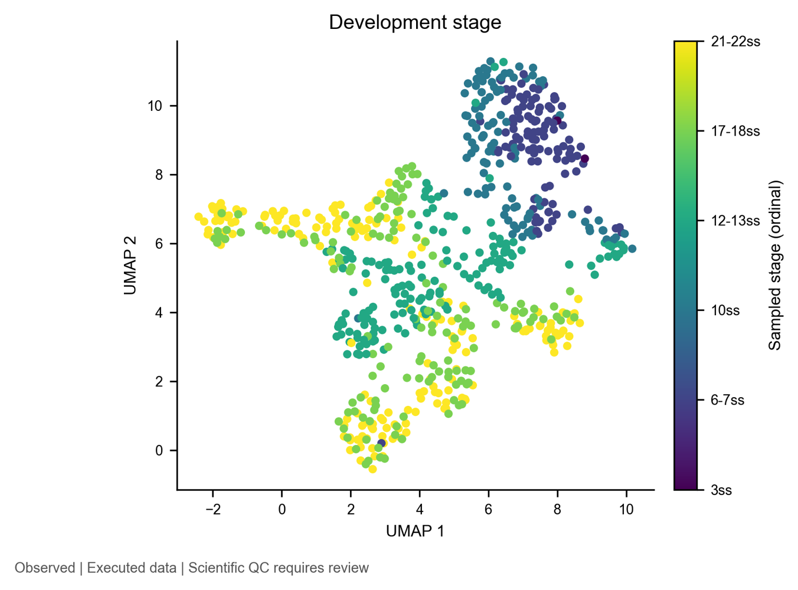

**状态：PASS；证据：Observed。** 按明确的体节阶段顺序显示取样信息；阶段序号不等于真实经过的小时数。

科学问题：Where are sampled stages represented? 输入：`C:\Users\13683\Documents\Codex\2026-10-10\files-pasted-by-the-user-codex\outputs\regvelo_results\official_zebrafish\hard_seed0\prepared.h5ad; C:\Users\13683\Documents\Codex\2026-10-10\files-pasted-by-the-user-codex\outputs\regvelo_data\raw\adata_zebrafish_preprocessed.h5ad`。计算：Ordinal stage mapping from explicit time_order。

[来源CSV](A02_source.csv) · [参数与生成命令](A02.metadata.json) · [PDF](A02.pdf) · [代码](../src/regvelo_workflow/plots.py)

适用边界：Somite stage is ordinal; it is not elapsed hours.

## A03 Spliced Unspliced QC / 剪接计数质量检查

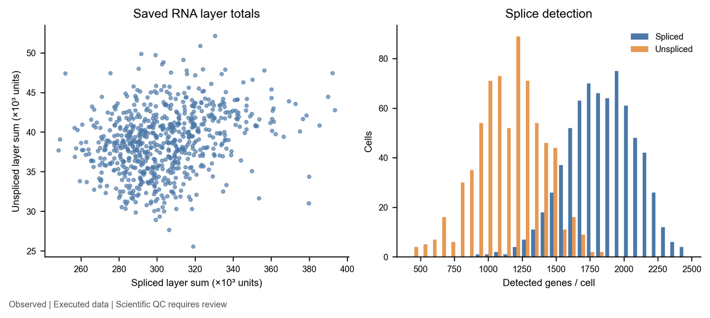

**状态：PASS；证据：Observed。** 检查保存的剪接层总量及每细胞检出基因数；已处理层单位不假设为原始UMI，检出不等于速度信号可靠。

科学问题：Is splice signal detected across cells? 输入：`C:\Users\13683\Documents\Codex\2026-10-10\files-pasted-by-the-user-codex\outputs\regvelo_data\raw\adata_zebrafish_preprocessed.h5ad`。计算：Saved splice-layer sums and detected-gene counts; preprocessed layer values are not assumed raw UMIs。

[来源CSV](A03_source.csv) · [参数与生成命令](A03.metadata.json) · [PDF](A03.pdf) · [代码](../src/regvelo_workflow/plots.py)

适用边界：Counts and detection do not establish a valid velocity direction.

## A04 GRN Coverage / GRN覆盖率

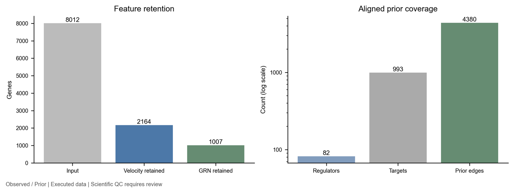

**状态：PASS；证据：Observed / Prior。** 展示特征过滤及实际对齐先验的regulator、target和边覆盖；有边不等于调控在该细胞中活跃。

科学问题：Which features and prior regulators survived preprocessing? 输入：`C:\Users\13683\Documents\Codex\2026-10-10\files-pasted-by-the-user-codex\outputs\regvelo_results\official_zebrafish\hard_seed0\tables\feature_retention.csv; C:\Users\13683\Documents\Codex\2026-10-10\files-pasted-by-the-user-codex\outputs\regvelo_results\official_zebrafish\hard_seed0\tables\prior_edges.csv`。计算：Recorded feature-retention and unique regulator/target/effective prior-edge counts。

[来源CSV](A04_source.csv) · [参数与生成命令](A04.metadata.json) · [PDF](A04.pdf) · [代码](../src/regvelo_workflow/plots.py)

适用边界：Static prior coverage is not evidence of active direct regulation.

## B01 Velocity Stream / RNA速度流场

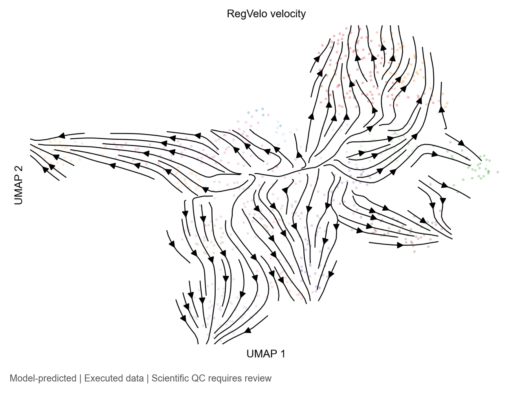

**状态：PASS；证据：Model-predicted。** 将RegVelo预测速度投影为UMAP流线，用于审查方向；投影不是实际细胞运动，仍需发育证据。

科学问题：What direction does RegVelo predict on the embedding? 输入：`C:\Users\13683\Documents\Codex\2026-10-10\files-pasted-by-the-user-codex\outputs\regvelo_results\official_zebrafish\hard_seed0\velocity.h5ad`。计算：scVelo stream interpolation of RegVelo velocity projection。

[来源CSV](B01_source.csv) · [参数与生成命令](B01.metadata.json) · [PDF](B01.pdf) · [代码](../src/regvelo_workflow/plots.py)

适用边界：UMAP streamlines project high-dimensional predictions; direction needs biological QC.

## B02 Velocity Arrows / RNA速度箭头

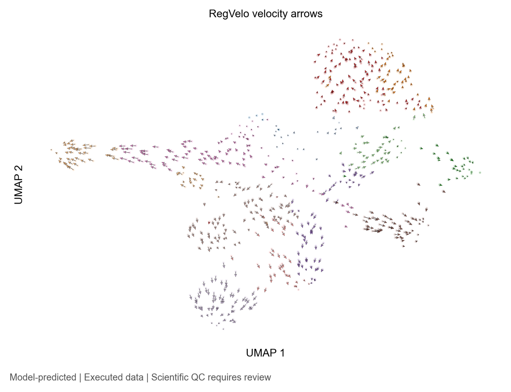

**状态：PASS；证据：Model-predicted。** 显示各细胞的预测速度箭头和局部差异；箭头的嵌入长度不是实验迁移速度。

科学问题：How heterogeneous are projected cell velocities? 输入：`C:\Users\13683\Documents\Codex\2026-10-10\files-pasted-by-the-user-codex\outputs\regvelo_results\official_zebrafish\hard_seed0\velocity.h5ad`。计算：scVelo arrows from RegVelo saved velocity_umap。

[来源CSV](B02_source.csv) · [参数与生成命令](B02.metadata.json) · [PDF](B02.pdf) · [代码](../src/regvelo_workflow/plots.py)

适用边界：Arrows are projected model velocities, not observed cell motion.

## B03 Latent Time / 潜在时间

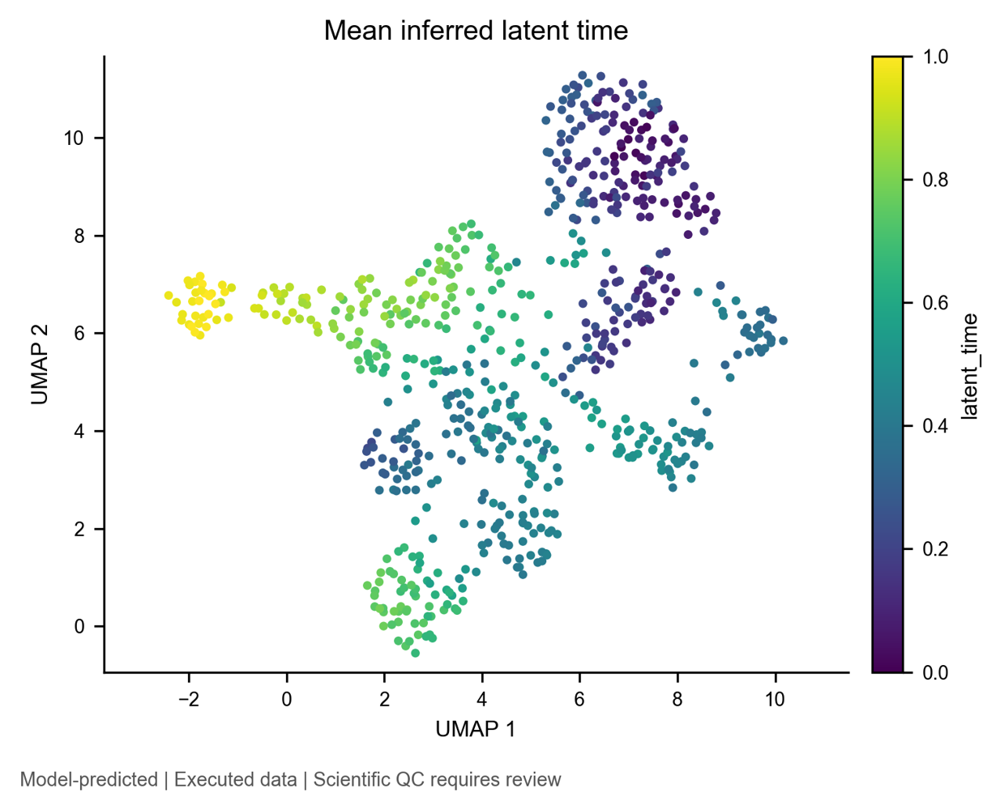

**状态：PASS；证据：Model-predicted。** 显示各细胞mean fit_t经min-max归一化后的相对顺序；不把它解释为真实时钟。

科学问题：How does mean inferred time vary across cells? 输入：`C:\Users\13683\Documents\Codex\2026-10-10\files-pasted-by-the-user-codex\outputs\regvelo_results\official_zebrafish\hard_seed0\velocity.h5ad`。计算：Min-max normalized per-cell mean inferred fit_t。

[来源CSV](B03_source.csv) · [参数与生成命令](B03.metadata.json) · [PDF](B03.pdf) · [代码](../src/regvelo_workflow/plots.py)

适用边界：Mean fit_t is min-max scaled, not calibrated elapsed time.

## B04 Velocity Phase Portrait / 速度相图

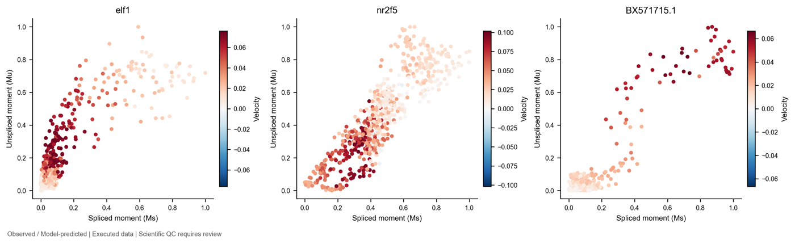

**状态：PASS；证据：Observed / Model-predicted。** 查看选定基因Ms/Mu关系与预测速度；本图不宣称拟合相线或独立验证动力学假设。

科学问题：How do selected genes relate to RNA moments and velocity? 输入：`C:\Users\13683\Documents\Codex\2026-10-10\files-pasted-by-the-user-codex\outputs\regvelo_results\official_zebrafish\hard_seed0\velocity.h5ad`。计算：Ms/Mu relationship colored by saved predicted velocity; no fitted phase line asserted。

[来源CSV](B04_source.csv) · [参数与生成命令](B04.metadata.json) · [PDF](B04.pdf) · [代码](../src/regvelo_workflow/plots.py)

适用边界：Moment relationships do not independently validate kinetic assumptions.

## B05 Training Curve / 模型训练曲线

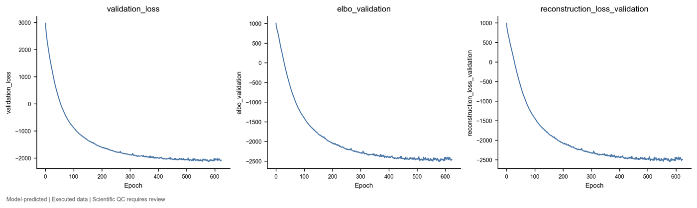

**状态：PASS；证据：Model-predicted。** 展示实际记录的训练目标变化；有限或下降的loss不能单独证明收敛、稳健或生物学正确。

科学问题：How did the recorded objective evolve? 输入：`C:\Users\13683\Documents\Codex\2026-10-10\files-pasted-by-the-user-codex\outputs\regvelo_results\official_zebrafish\hard_seed0\tables\training_history.csv`。计算：Actual saved training metrics; no convergence threshold inferred。

[来源CSV](B05_source.csv) · [参数与生成命令](B05.metadata.json) · [PDF](B05.pdf) · [代码](../src/regvelo_workflow/plots.py)

适用边界：Finite or decreasing loss alone does not prove convergence or biological validity.

## B06 Velocity Uncertainty / 速度不确定性

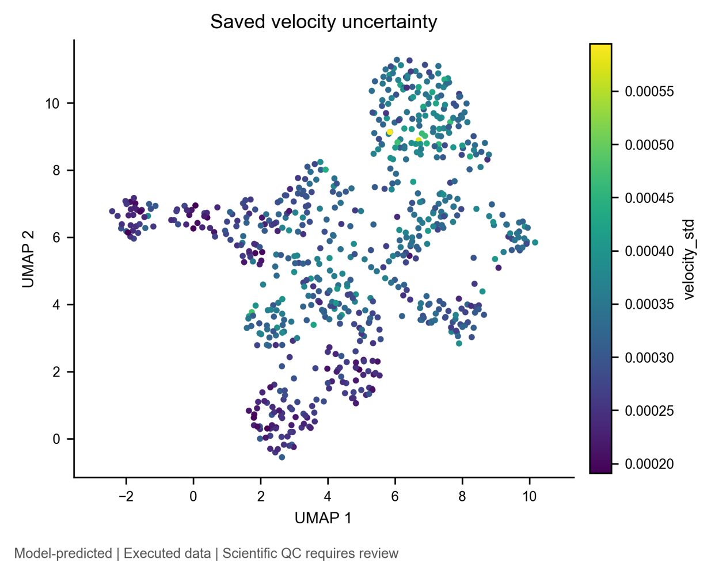

**状态：PASS；证据：Model-predicted。** 展示已保存的后验速度不确定性；没有保存抽样离散度时保持NOT_RUN，不能由平均速度反推。

科学问题：Where is saved posterior velocity uncertainty high? 输入：`C:\Users\13683\Documents\Codex\2026-10-10\files-pasted-by-the-user-codex\outputs\regvelo_results\official_zebrafish\hard_seed0\velocity.h5ad`。计算：Mean saved posterior uncertainty across genes。

[来源CSV](B06_source.csv) · [参数与生成命令](B06.metadata.json) · [PDF](B06.pdf) · [代码](../src/regvelo_workflow/plots.py)

适用边界：Requires saved posterior uncertainty; mean velocity cannot recover it.

## B07 RegVelo vs scVelo / RegVelo与scVelo对照

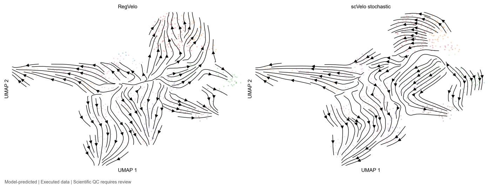

**状态：PASS；证据：Model-predicted。** 在同细胞与基因下比较RegVelo和scVelo stochastic投影；一致性不等于识别了真实方向。

科学问题：Do the two saved velocity fields agree? 输入：`C:\Users\13683\Documents\Codex\2026-10-10\files-pasted-by-the-user-codex\outputs\regvelo_results\official_zebrafish\hard_seed0\velocity.h5ad; C:\Users\13683\Documents\Codex\2026-10-10\files-pasted-by-the-user-codex\outputs\regvelo_results\official_zebrafish\hard_seed0\scvelo_stochastic.h5ad`。计算：Same-cell RegVelo and stochastic scVelo stream projections。

[来源CSV](B07_source.csv) · [参数与生成命令](B07.metadata.json) · [PDF](B07.pdf) · [代码](../src/regvelo_workflow/plots.py)

适用边界：Agreement does not identify a ground-truth direction.

## C01 Macrostates / 宏观状态

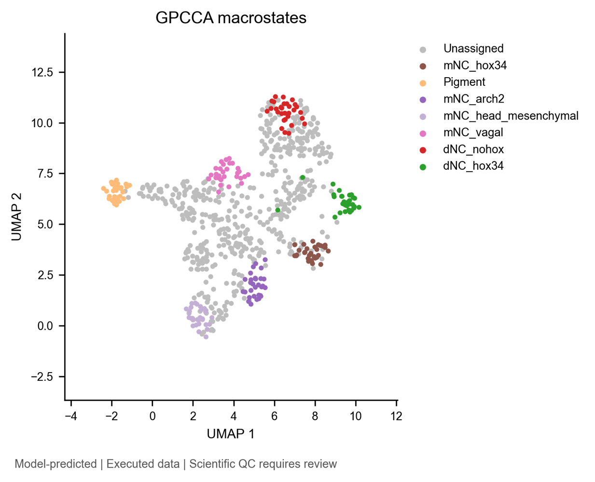

**状态：PASS；证据：Model-predicted。** 展示GPCCA推断的宏观状态；状态边界依赖转移核和状态数，不能自动当作真实亚型。

科学问题：Which macrostates were inferred? 输入：`C:\Users\13683\Documents\Codex\2026-10-10\files-pasted-by-the-user-codex\outputs\regvelo_results\official_zebrafish\hard_seed0\fate.h5ad; C:\Users\13683\Documents\Codex\2026-10-10\files-pasted-by-the-user-codex\outputs\regvelo_results\official_zebrafish\hard_seed0\tables\cellrank_states.csv`。计算：Saved GPCCA state assignment; unassigned cells retained。

[来源CSV](C01_source.csv) · [参数与生成命令](C01.metadata.json) · [PDF](C01.pdf) · [代码](../src/regvelo_workflow/plots.py)

适用边界：Macrostates depend on the transition kernel and state-number choice.

## C02 Terminal States / 终末状态

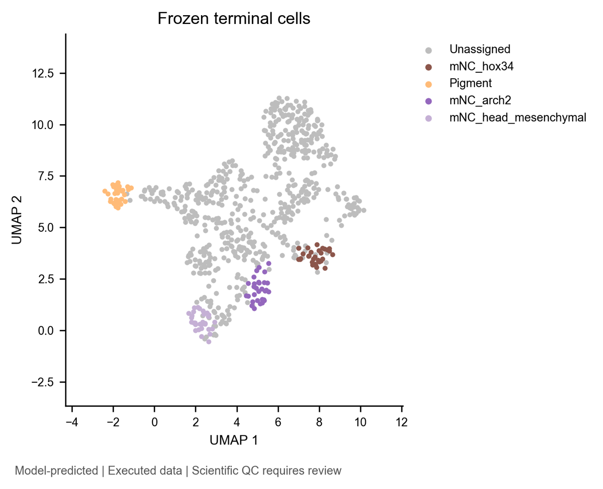

**状态：PASS；证据：Model-predicted。** 标示冻结的终末细胞集合，并保留未分配细胞；终末定义仍需细胞身份和发育过程支持。

科学问题：Which cells define the terminal sets? 输入：`C:\Users\13683\Documents\Codex\2026-10-10\files-pasted-by-the-user-codex\outputs\regvelo_results\official_zebrafish\hard_seed0\fate.h5ad; C:\Users\13683\Documents\Codex\2026-10-10\files-pasted-by-the-user-codex\outputs\regvelo_results\official_zebrafish\hard_seed0\tables\cellrank_states.csv`。计算：Saved GPCCA state assignment; unassigned cells retained。

[来源CSV](C02_source.csv) · [参数与生成命令](C02.metadata.json) · [PDF](C02.pdf) · [代码](../src/regvelo_workflow/plots.py)

适用边界：Terminal definitions must be supported by developmental biology.

## C03 Fate Probabilities / 命运概率

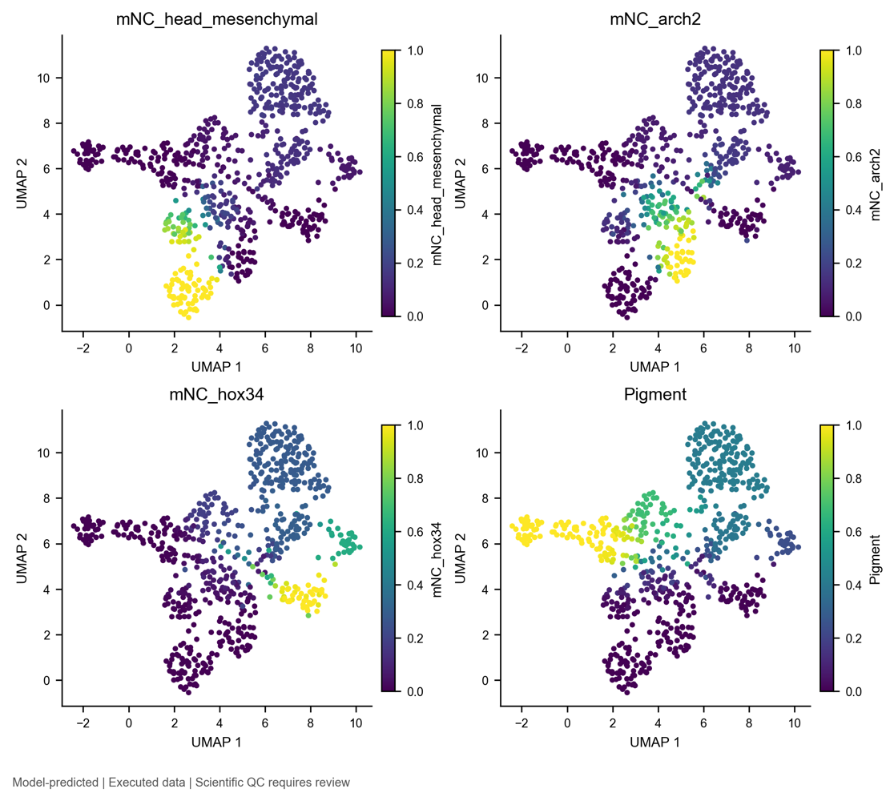

**状态：PASS；证据：Model-predicted。** 展示模型转移链对各终末集合的吸收概率；这是给定核与终末定义的条件预测。

科学问题：How is absorption probability distributed? 输入：`C:\Users\13683\Documents\Codex\2026-10-10\files-pasted-by-the-user-codex\outputs\regvelo_results\official_zebrafish\hard_seed0\tables\baseline_fate_probabilities.csv; C:\Users\13683\Documents\Codex\2026-10-10\files-pasted-by-the-user-codex\outputs\regvelo_results\official_zebrafish\hard_seed0\fate.h5ad`。计算：CellRank absorption probabilities for saved terminal sets。

[来源CSV](C03_source.csv) · [参数与生成命令](C03.metadata.json) · [PDF](C03.pdf) · [代码](../src/regvelo_workflow/plots.py)

适用边界：Probabilities are conditional on the model and frozen terminal definitions.

## C04 Commitment Score / 命运承诺评分

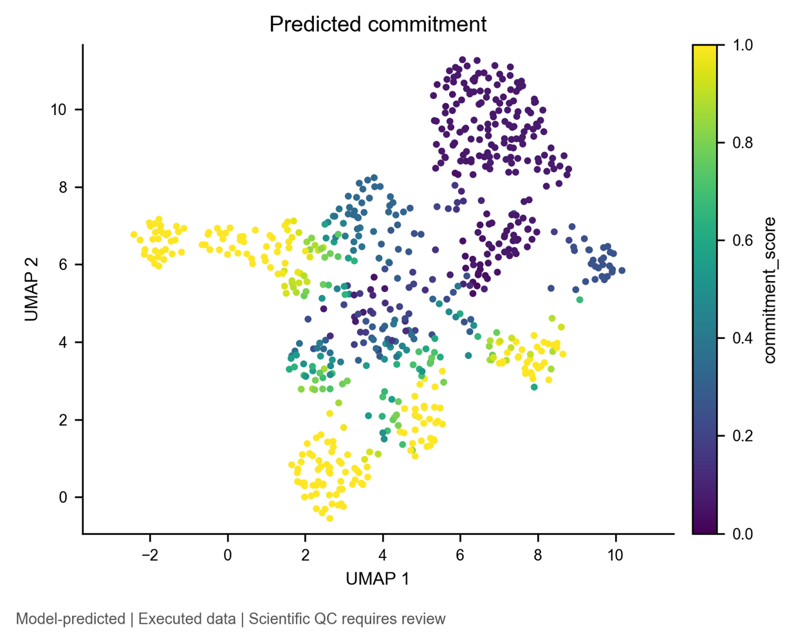

**状态：PASS；证据：Model-predicted。** 用1减去归一化Shannon熵表示命运概率集中程度；不等于真实不可逆命运承诺。

科学问题：Where is predicted terminal fate concentration strongest? 输入：`C:\Users\13683\Documents\Codex\2026-10-10\files-pasted-by-the-user-codex\outputs\regvelo_results\official_zebrafish\hard_seed0\fate.h5ad`。计算：Saved 1 minus base-2 Shannon entropy normalized by the base-2 logarithm of the terminal count。

[来源CSV](C04_source.csv) · [参数与生成命令](C04.metadata.json) · [PDF](C04.pdf) · [代码](../src/regvelo_workflow/plots.py)

适用边界：One minus normalized Shannon entropy is not irreversible experimental commitment.

## C05 Fate Probability Heatmap / 命运概率热图

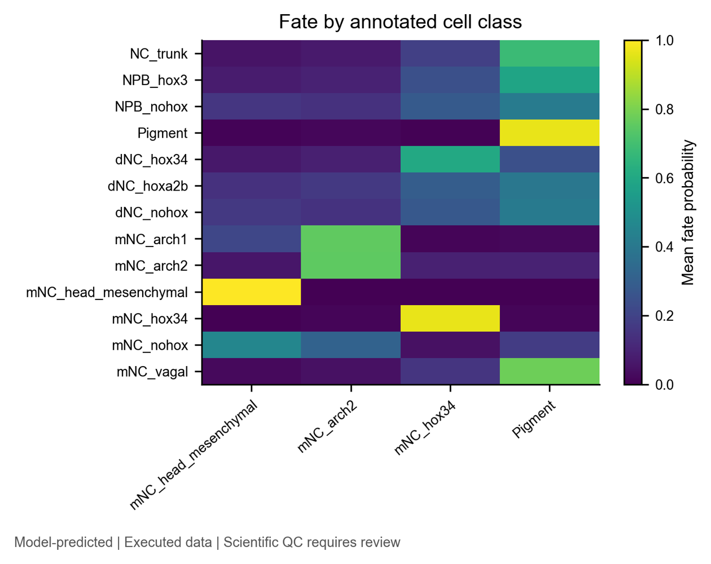

**状态：PASS；证据：Model-predicted。** 比较已有细胞标签内的平均命运概率；均值会隐藏群内差异，细胞不能当独立生物学重复。

科学问题：How do annotated classes differ in mean predicted fate? 输入：`C:\Users\13683\Documents\Codex\2026-10-10\files-pasted-by-the-user-codex\outputs\regvelo_results\official_zebrafish\hard_seed0\tables\baseline_fate_probabilities.csv; C:\Users\13683\Documents\Codex\2026-10-10\files-pasted-by-the-user-codex\outputs\regvelo_results\official_zebrafish\hard_seed0\fate.h5ad`。计算：Mean saved fate probabilities within annotations。

[来源CSV](C05_source.csv) · [参数与生成命令](C05.metadata.json) · [PDF](C05.pdf) · [代码](../src/regvelo_workflow/plots.py)

适用边界：Group means hide within-class variation and are not independent biological replicates.

## D01 TF Target Network / TF靶基因网络

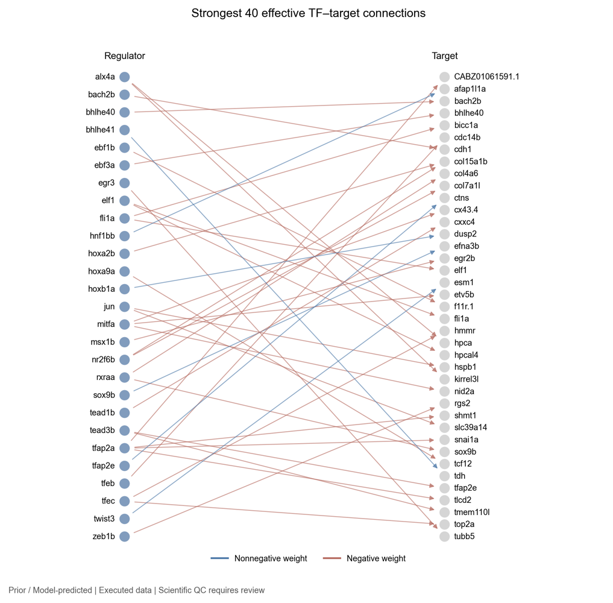

**状态：PASS；证据：Prior / Model-predicted。** 显示绝对有效fc1权重最强的40条边；箭头服从模型API方向，不表示已证实直接结合或因果。

科学问题：What are the strongest saved effective connections? 输入：`C:\Users\13683\Documents\Codex\2026-10-10\files-pasted-by-the-user-codex\outputs\regvelo_results\official_zebrafish\hard_seed0\tables\tf_target_edges.csv`。计算：Directed two-column layout of top40 absolute fc1 weights; separate regulator/target roles, signed edge colors。

[来源CSV](D01_source.csv) · [参数与生成命令](D01.metadata.json) · [PDF](D01.pdf) · [代码](../src/regvelo_workflow/plots.py)

适用边界：Model weight arrows denote API orientation, not proven causal binding.

## D02 GRN Adjacency Heatmap / GRN邻接热图

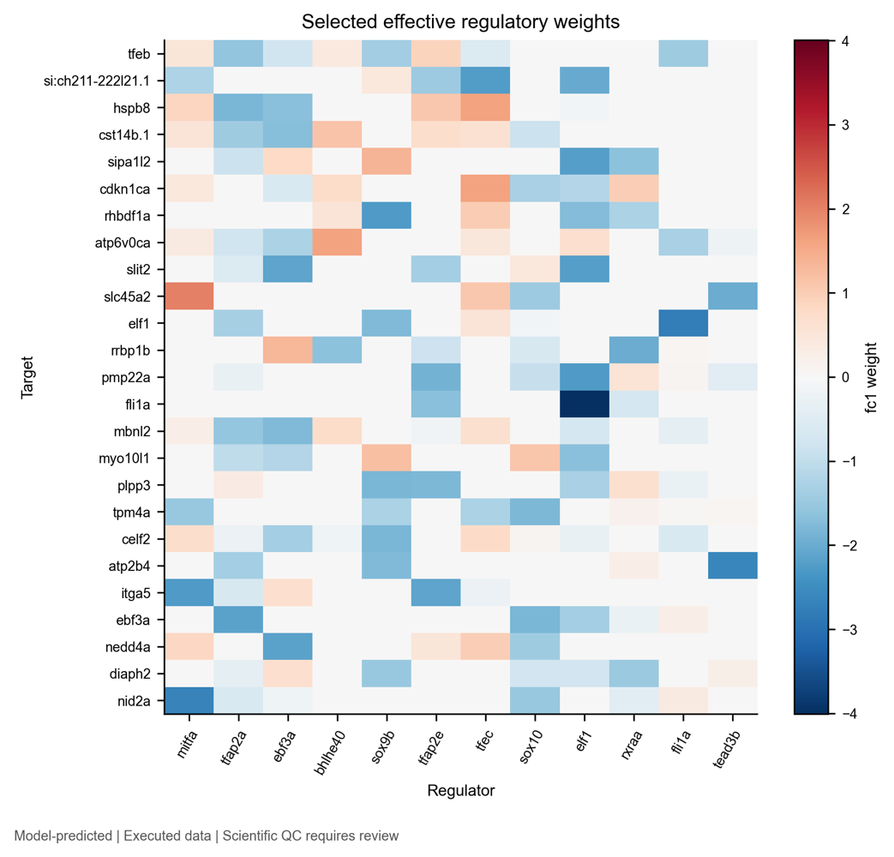

**状态：PASS；证据：Model-predicted。** 以target为行、regulator为列展示选定有符号权重；按绝对权重选图，完整边表保留供审查。

科学问题：What signed weights connect selected regulators and targets? 输入：`C:\Users\13683\Documents\Codex\2026-10-10\files-pasted-by-the-user-codex\outputs\regvelo_results\official_zebrafish\hard_seed0\tables\tf_target_edges.csv`。计算：Signed target-by-regulator weight heatmap; top12 regulators/top25 targets by sum absolute weights。

[来源CSV](D02_source.csv) · [参数与生成命令](D02.metadata.json) · [PDF](D02.pdf) · [代码](../src/regvelo_workflow/plots.py)

适用边界：Display selection is based on absolute weights; full edges remain in the source table.

## D03 Regulon Ranking / Regulon排序

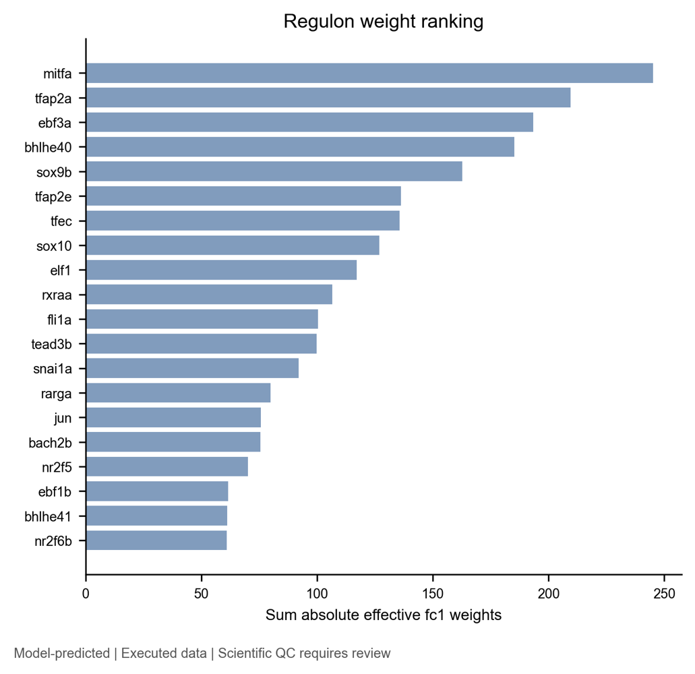

**状态：PASS；证据：Model-predicted。** 按有效边绝对权重之和排列regulator；排序不是已验证TF功能重要性或治疗效应。

科学问题：Which regulators have the largest summed absolute effective weights? 输入：`C:\Users\13683\Documents\Codex\2026-10-10\files-pasted-by-the-user-codex\outputs\regvelo_results\official_zebrafish\hard_seed0\tables\regulon_ranking.csv`。计算：Sum absolute learned effective weights per regulator; top20 display。

[来源CSV](D03_source.csv) · [参数与生成命令](D03.metadata.json) · [PDF](D03.pdf) · [代码](../src/regvelo_workflow/plots.py)

适用边界：Large summed weight is not validated TF importance or clinical effect.

## D04 Regulatory Weight Distribution / 调控权重分布

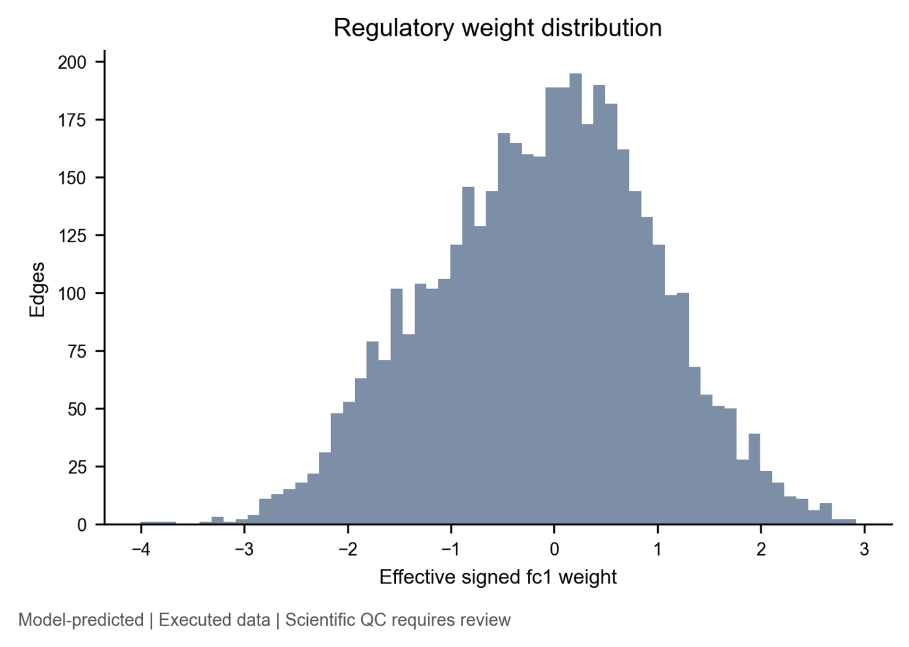

**状态：PASS；证据：Model-predicted。** 查看阈值以上的有符号训练权重分布；fc1参数与归一化表达Jacobian不同，均不等于实验结合。

科学问题：How are signed trained weights distributed? 输入：`C:\Users\13683\Documents\Codex\2026-10-10\files-pasted-by-the-user-codex\outputs\regvelo_results\official_zebrafish\hard_seed0\tables\tf_target_edges.csv`。计算：Histogram of saved edges above configured grn_cutoff。

[来源CSV](D04_source.csv) · [参数与生成命令](D04.metadata.json) · [PDF](D04.pdf) · [代码](../src/regvelo_workflow/plots.py)

适用边界：fc1 weights differ from normalized-expression Jacobians.

## D05 Prior vs Inferred GRN / 先验与推断GRN比较

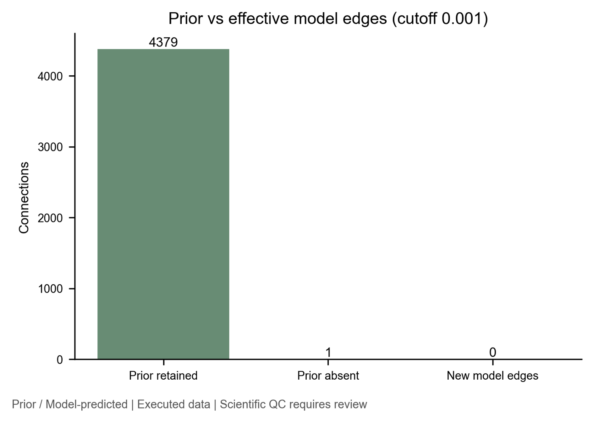

**状态：PASS；证据：Prior / Model-predicted。** 比较有效模型边与先验的重合、丢失和新增；新增连接尚无实验支持，数量依赖cutoff。

科学问题：How many effective learned edges overlap the prior? 输入：`C:\Users\13683\Documents\Codex\2026-10-10\files-pasted-by-the-user-codex\outputs\regvelo_results\official_zebrafish\hard_seed0\GRN_QC.json`。计算：Thresholded effective fc1 edges intersected with aligned prior。

[来源CSV](D05_source.csv) · [参数与生成命令](D05.metadata.json) · [PDF](D05.pdf) · [代码](../src/regvelo_workflow/plots.py)

适用边界：New model edges lack experimental support; threshold affects counts.

## E01 Baseline vs KO Velocity / 基线与KO速度比较

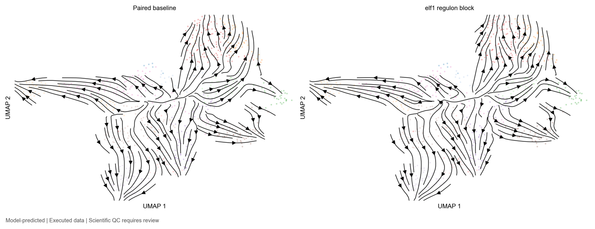

**状态：PASS；证据：Model-predicted。** 比较配对后验基线与单独重算的regulon阻断速度投影；这是模型内虚拟KO，不是CRISPR实验。

科学问题：How does a paired regulon block change projected velocity? 输入：`C:\Users\13683\Documents\Codex\2026-10-10\files-pasted-by-the-user-codex\outputs\regvelo_results\official_zebrafish\hard_seed0\baseline_posterior.h5ad; C:\Users\13683\Documents\Codex\2026-10-10\files-pasted-by-the-user-codex\outputs\regvelo_results\official_zebrafish\hard_seed0\perturb_elf1.h5ad`。计算：Paired posterior baseline and independently recomputed KO velocity embedding。

[来源CSV](E01_source.csv) · [参数与生成命令](E01.metadata.json) · [PDF](E01.pdf) · [代码](../src/regvelo_workflow/plots.py)

适用边界：Paired posterior draws and separate KO embeddings are required; this is not CRISPR.

## E02 Cell-wise Perturbation Effect / 逐细胞扰动效应

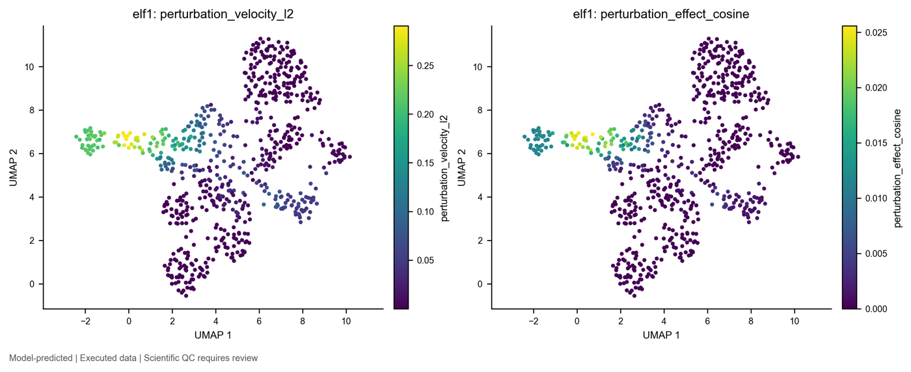

**状态：PASS；证据：Model-predicted。** 显示逐细胞高维速度L2差及1-cosine方向差；这些是模型分数，不是表达log2FC或实验效应量。

科学问题：Which cells change most in velocity magnitude or direction? 输入：`C:\Users\13683\Documents\Codex\2026-10-10\files-pasted-by-the-user-codex\outputs\regvelo_results\official_zebrafish\hard_seed0\tables\elf1_cell_effect.csv; C:\Users\13683\Documents\Codex\2026-10-10\files-pasted-by-the-user-codex\outputs\regvelo_results\official_zebrafish\hard_seed0\perturb_elf1.h5ad`。计算：Cell-wise high-dimensional velocity L2 change and 1-cosine; saved paired predictions。

[来源CSV](E02_source.csv) · [参数与生成命令](E02.metadata.json) · [PDF](E02.pdf) · [代码](../src/regvelo_workflow/plots.py)

适用边界：L2 velocity difference and 1-cosine are model scores, not expression log2FC.

## E03 Fate Probability Difference / 命运概率差

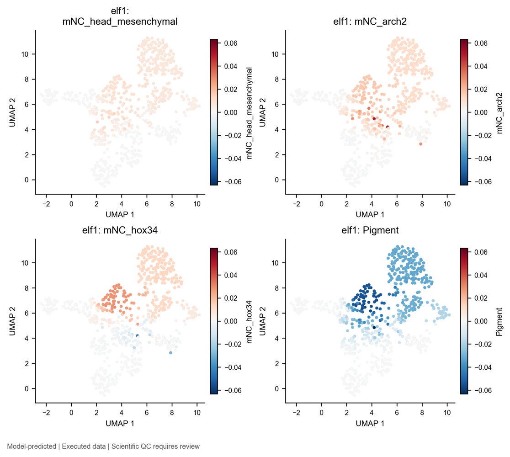

**状态：PASS；证据：Model-predicted。** 展示KO减配对基线的命运概率差；原始与扰动使用同一细胞、特征和冻结终末细胞集合。

科学问题：How do frozen-terminal fate probabilities change? 输入：`C:\Users\13683\Documents\Codex\2026-10-10\files-pasted-by-the-user-codex\outputs\regvelo_results\official_zebrafish\hard_seed0\tables\elf1_fate_difference.csv; C:\Users\13683\Documents\Codex\2026-10-10\files-pasted-by-the-user-codex\outputs\regvelo_results\official_zebrafish\hard_seed0\perturb_elf1.h5ad`。计算：KO minus paired baseline fate probabilities; terminal cells frozen。

[来源CSV](E03_source.csv) · [参数与生成命令](E03.metadata.json) · [PDF](E03.pdf) · [代码](../src/regvelo_workflow/plots.py)

适用边界：KO minus paired baseline is conditional on the same terminal cell sets.

## E04 Depletion Enrichment / 命运消耗富集

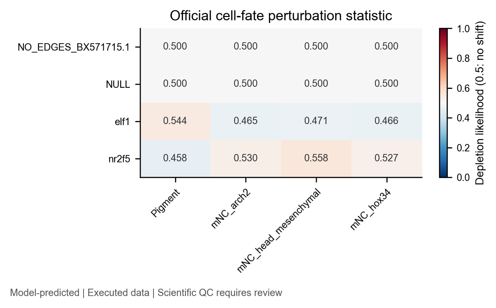

**状态：PASS；证据：Model-predicted。** 展示官方ROC AUC depletion likelihood及NULL对照，以0.5为无变化参照；大于0.5指向模型内消耗、小于0.5指向富集。p/FDR来自pooled-cell单侧ranksums/BH，不能当作独立生物学重复或真实实验效应。

科学问题：What does the official depletion statistic report? 输入：`C:\Users\13683\Documents\Codex\2026-10-10\files-pasted-by-the-user-codex\outputs\regvelo_results\official_zebrafish\hard_seed0\tables\perturbation_depletion.csv`。计算：Official regvelo.mt.cellfate_perturbation(method=likelihood) ROC AUC on [0,1], neutral 0.5; NULL included as control。

[来源CSV](E04_source.csv) · [参数与生成命令](E04.metadata.json) · [PDF](E04.pdf) · [代码](../src/regvelo_workflow/plots.py)

适用边界：ROC AUC has a 0.5 neutral reference; pooled-cell ranksums/BH values do not provide biological-replicate evidence.

## E05 TF Perturbation Ranking / TF扰动排序

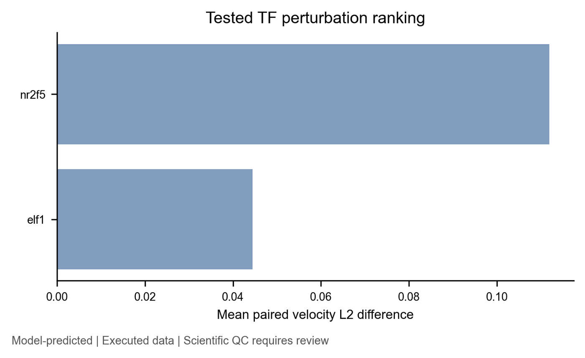

**状态：PASS；证据：Model-predicted。** 按平均逐细胞速度L2变化比较实际测试的TF；只覆盖本次目标，不能据此宣布疾病驱动因子。

科学问题：How do tested TFs rank by mean velocity change? 输入：`C:\Users\13683\Documents\Codex\2026-10-10\files-pasted-by-the-user-codex\outputs\regvelo_results\official_zebrafish\hard_seed0\tables\perturbation_summary.csv`。计算：Mean saved cell-wise high-dimensional velocity change; tested targets only。

[来源CSV](E05_source.csv) · [参数与生成命令](E05.metadata.json) · [PDF](E05.pdf) · [代码](../src/regvelo_workflow/plots.py)

适用边界：Ranks compare only tested targets and cannot establish disease drivers.

## E06 GRN Before After KO / KO前后GRN

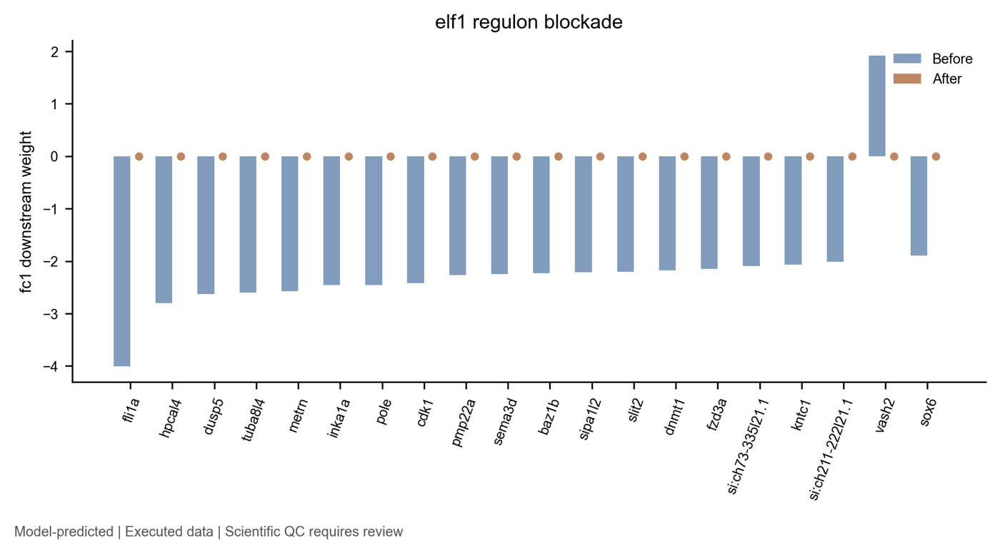

**状态：PASS；证据：Model-predicted。** 检查所选TF下游模型权重阻断前后的数值；删除模型连接不等于生物学删除基因。

科学问题：Were the selected TF downstream weights blocked? 输入：`C:\Users\13683\Documents\Codex\2026-10-10\files-pasted-by-the-user-codex\outputs\regvelo_results\official_zebrafish\hard_seed0\tables\elf1_blocked_edges.csv`。计算：Paired model weight before/after selected TF downstream block; top20 absolute baseline targets。

[来源CSV](E06_source.csv) · [参数与生成命令](E06.metadata.json) · [PDF](E06.pdf) · [代码](../src/regvelo_workflow/plots.py)

适用边界：Removing model weights simulates regulon blockade, not biological gene deletion.
