# 图形画廊 / Visualization gallery

先看预览 → 选择 Plot ID → 查找登记的代码与参数。

**36 个实际由 R 渲染的 PNG／PDF 示例。** 下表区分公开真实数据示例与合成风格演示；模板验证只证明对应示例的记录范围，不证明生物学结论。CellChat／Monocle3 原生预览仍受阻。

状态：`CURRENT_DEFAULT` 是当前优选模板；`SYNTHETIC` 是合成演示；`PASS` 仅表示记录范围内检查通过。图中英文标签和图形文件保留原样。复用步骤见[中文使用指南](docs/USAGE_ZH_CN.md)。

## UMAP／注释／单细胞

| Plot ID／用途 | 预览 | 方法／代码／参数／矢量图 | 状态与数据 |
|---|---|---|---|
| `umap_clean_v1`<br>已计算的聚类在 UMAP 中如何分布？ | [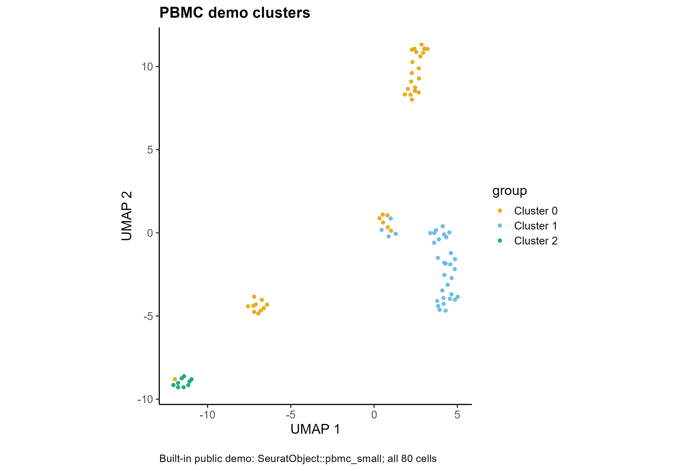](08_visualization/UMAP/gallery/umap_clean_v1.png) | [方法](01_scrna_core/clustering/METHOD_CARD.md) · [代码](08_visualization/UMAP/umap_clean_v1.R) · [参数](08_visualization/UMAP/gallery/umap_clean_v1.metadata.json) · [PDF](08_visualization/UMAP/gallery/umap_clean_v1.pdf) | 渲染 PASS; SeuratObject::pbmc_small; 全部 80 个细胞; CURRENT_DEFAULT |
| `umap_fireworks_atlas`<br>烟花风格 atlas：密集彩色真实细胞 | [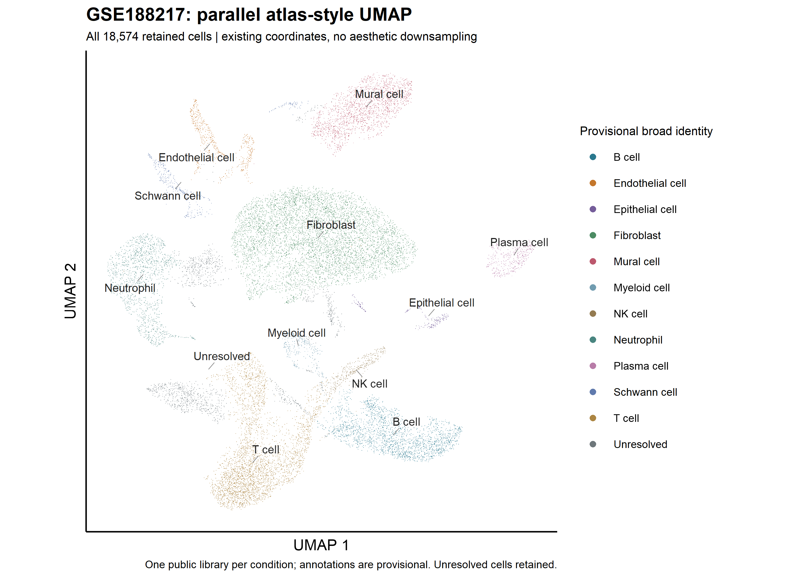](08_visualization/UMAP/gallery/umap_fireworks_atlas.png) | [中文输入与图例](08_visualization/UMAP/README.md) · [代码](08_visualization/UMAP/umap_fireworks_atlas.R) · [参数](08_visualization/UMAP/gallery/umap_fireworks_atlas.metadata.json) · [PDF](08_visualization/UMAP/gallery/umap_fireworks_atlas.pdf) | 渲染/坐标保留 PASS；GSE188217 全部 18,574 细胞；标签暂定；ALTERNATIVE（并列，非 V2） |
| `umap_density_landscape`<br>共享二维 UMAP 的 3D 密度山峦 | [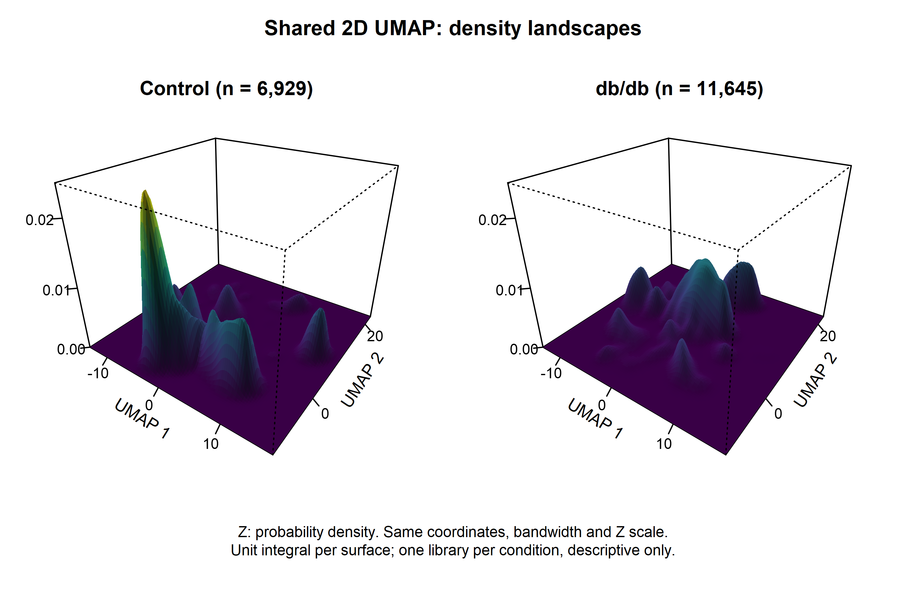](08_visualization/UMAP/gallery/umap_density_landscape.png) | [中文输入与图例](08_visualization/UMAP/README.md) · [代码](08_visualization/UMAP/umap_density_landscape.R) · [参数](08_visualization/UMAP/gallery/umap_density_landscape.metadata.json) · [PDF](08_visualization/UMAP/gallery/umap_density_landscape.pdf) | 渲染/概率积分 PASS；GSE188217 两文库；Z 为密度，非 UMAP3；ALTERNATIVE |
| `feature_clean_v1`<br>LYZ 在哪些细胞中表达？ | [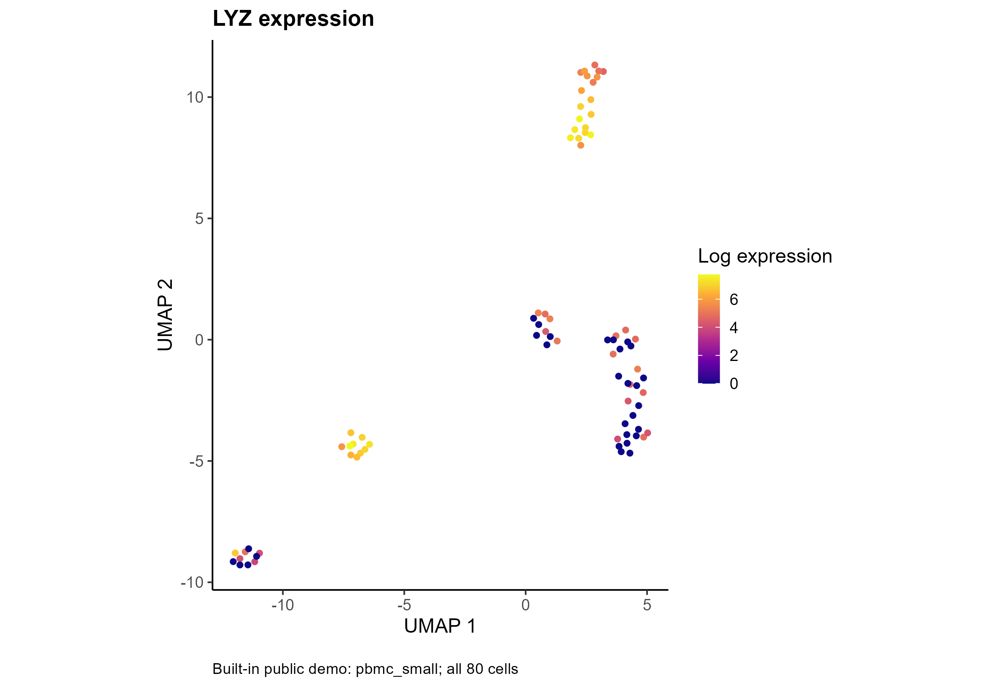](08_visualization/FeaturePlot/gallery/feature_clean_v1.png) | [方法](01_scrna_core/normalization/lognormalize/METHOD_CARD.md) · [代码](08_visualization/FeaturePlot/feature_clean_v1.R) · [参数](08_visualization/FeaturePlot/gallery/feature_clean_v1.metadata.json) · [PDF](08_visualization/FeaturePlot/gallery/feature_clean_v1.pdf) | 渲染 PASS; pbmc_small; 全部 80 个细胞; CURRENT_DEFAULT |
| `dotplot_clean_v1`<br>所选 marker 在不同聚类中如何表达？ | [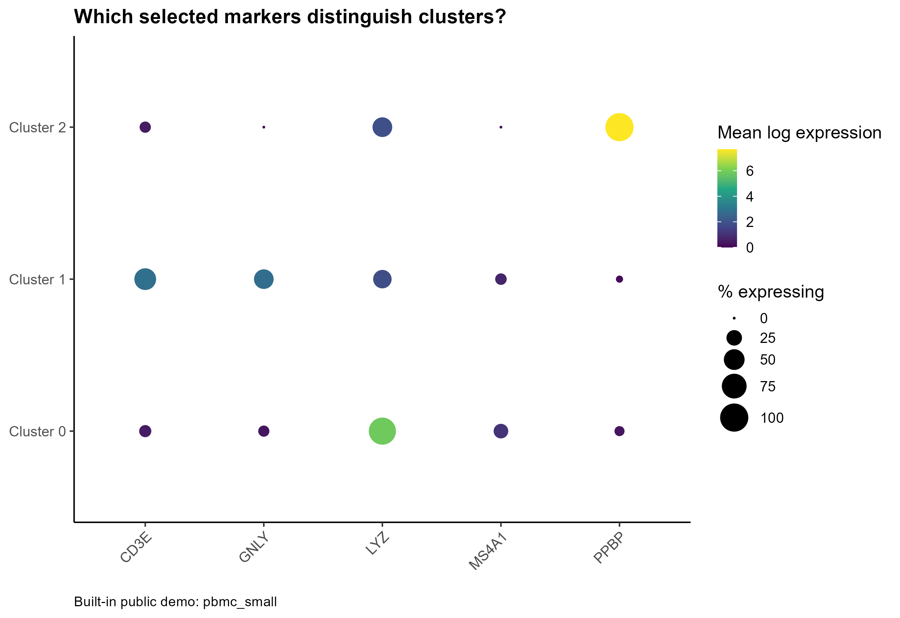](08_visualization/DotPlot/gallery/dotplot_clean_v1.png) | [方法](02_differential_analysis/differential_expression/METHOD_CARD.md) · [代码](08_visualization/DotPlot/dotplot_clean_v1.R) · [参数](08_visualization/DotPlot/gallery/dotplot_clean_v1.metadata.json) · [PDF](08_visualization/DotPlot/gallery/dotplot_clean_v1.pdf) | 渲染 PASS; pbmc_small; CURRENT_DEFAULT |
| `marker_heatmap_v1`<br>所选 marker 的均值如何随聚类变化？ | [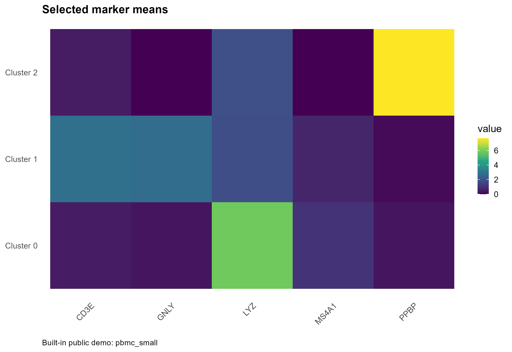](08_visualization/Heatmap/gallery/marker_heatmap_v1.png) | [方法](02_differential_analysis/differential_expression/METHOD_CARD.md) · [代码](08_visualization/Heatmap/heatmap_clean_v1.R) · [参数](08_visualization/Heatmap/gallery/marker_heatmap_v1.metadata.json) · [PDF](08_visualization/Heatmap/gallery/marker_heatmap_v1.pdf) | 渲染 PASS; pbmc_small; CURRENT_DEFAULT |
| `cluster_heatmap_v1`<br>不同聚类有哪些表达模式？ | [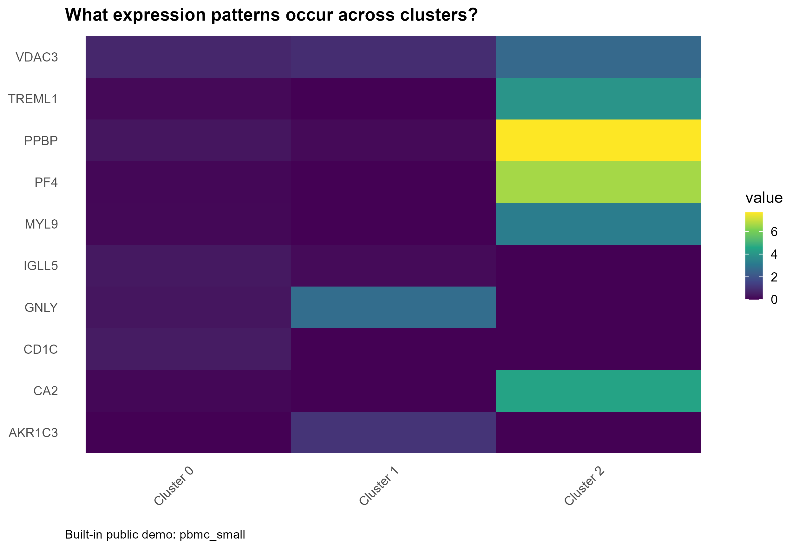](08_visualization/Heatmap/gallery/cluster_heatmap_v1.png) | [绘图库](08_visualization/README.md) · [代码](scripts/generate_gallery.R) · [参数](08_visualization/Heatmap/gallery/cluster_heatmap_v1.metadata.json) · [PDF](08_visualization/Heatmap/gallery/cluster_heatmap_v1.pdf) | 渲染 PASS; pbmc_small; 演示资产 |
| `violin_clean_v1`<br>单细胞 LYZ 表达如何分布？ | [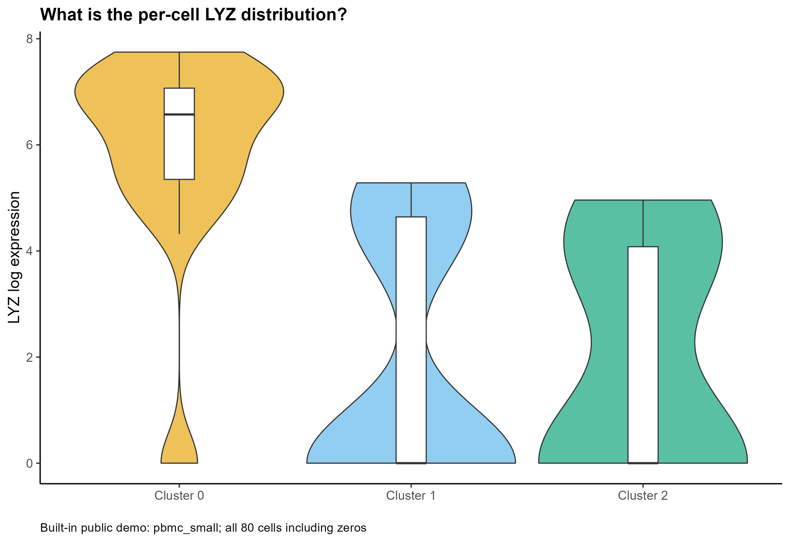](08_visualization/Violin/gallery/violin_clean_v1.png) | [方法](01_scrna_core/normalization/lognormalize/METHOD_CARD.md) · [代码](08_visualization/Violin/violin_clean_v1.R) · [参数](08_visualization/Violin/gallery/violin_clean_v1.metadata.json) · [PDF](08_visualization/Violin/gallery/violin_clean_v1.pdf) | 渲染 PASS; pbmc_small; 全部 80 个细胞，保留零值; CURRENT_DEFAULT |
| `stacked_violin_v1`<br>多个 marker 的表达分布如何变化？ | [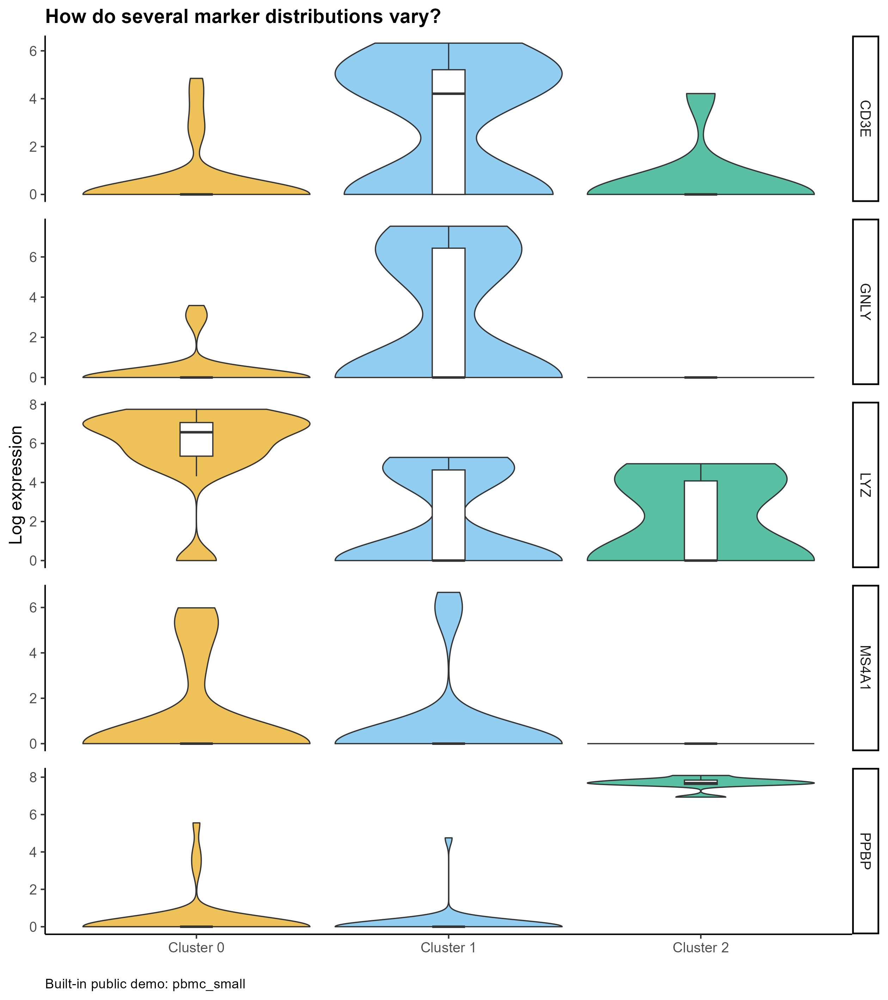](08_visualization/Violin/gallery/stacked_violin_v1.png) | [绘图库](08_visualization/README.md) · [代码](scripts/generate_gallery.R) · [参数](08_visualization/Violin/gallery/stacked_violin_v1.metadata.json) · [PDF](08_visualization/Violin/gallery/stacked_violin_v1.pdf) | 渲染 PASS; pbmc_small; 演示资产 |
| `composition_sample_v1`<br>本次捕获中各聚类所占比例是多少？ | [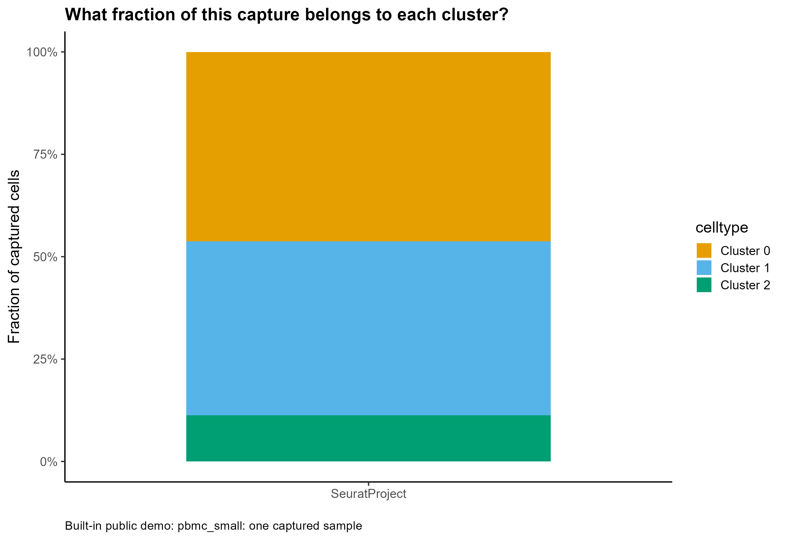](08_visualization/Composition/gallery/composition_sample_v1.png) | [绘图库](08_visualization/README.md) · [代码](08_visualization/Composition/composition_sample_v1.R) · [参数](08_visualization/Composition/gallery/composition_sample_v1.metadata.json) · [PDF](08_visualization/Composition/gallery/composition_sample_v1.pdf) | 渲染 PASS; pbmc_small: 一个捕获样本; CURRENT_DEFAULT |
| `cluster_count_bar_v1`<br>每个聚类分配了多少细胞？ | [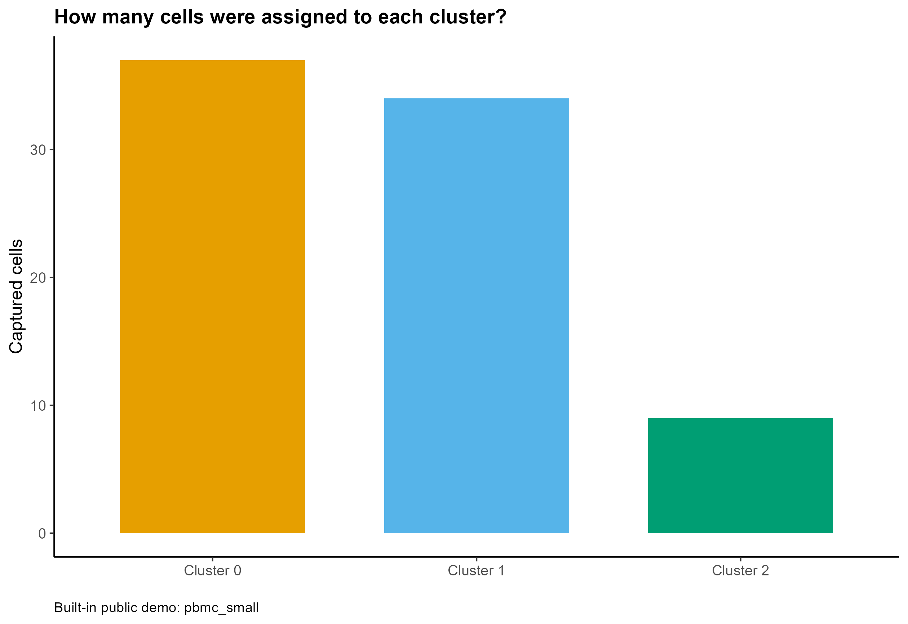](08_visualization/Barplot/gallery/cluster_count_bar_v1.png) | [绘图库](08_visualization/README.md) · [代码](scripts/generate_gallery.R) · [参数](08_visualization/Barplot/gallery/cluster_count_bar_v1.metadata.json) · [PDF](08_visualization/Barplot/gallery/cluster_count_bar_v1.pdf) | 渲染 PASS; pbmc_small; 演示资产 |
| `multipanel_pbmc_v1`<br>PBMC 示例概览 | [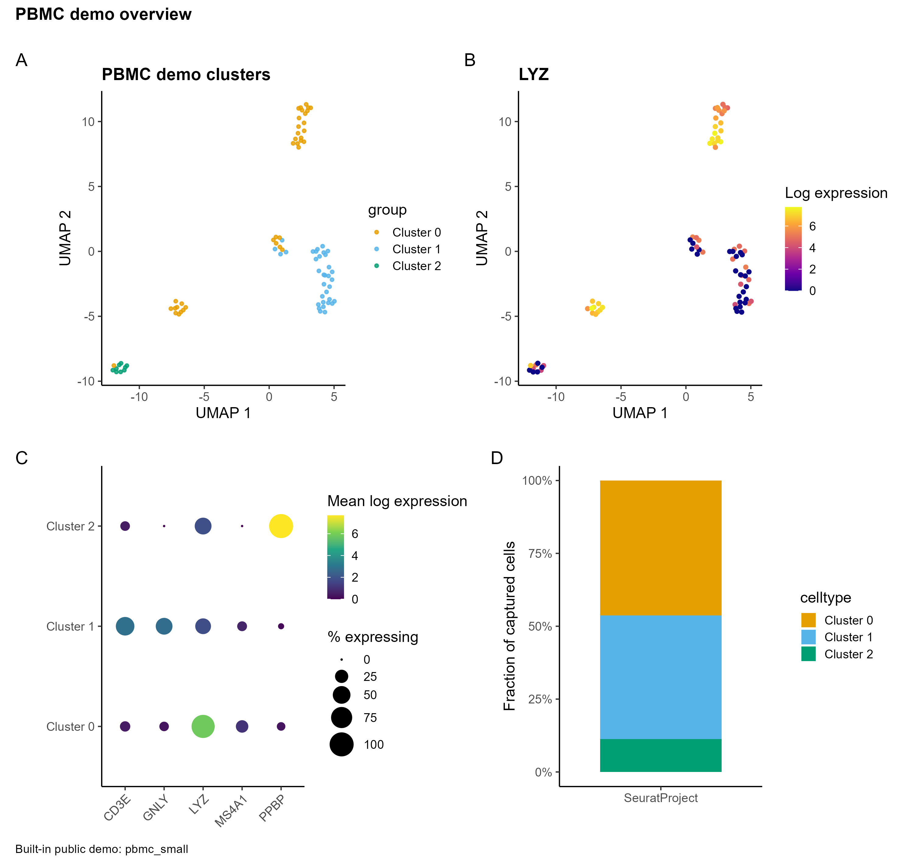](08_visualization/MultiPanel/gallery/multipanel_pbmc_v1.png) | [绘图库](08_visualization/README.md) · [代码](scripts/generate_gallery.R) · [参数](08_visualization/MultiPanel/gallery/multipanel_pbmc_v1.metadata.json) · [PDF](08_visualization/MultiPanel/gallery/multipanel_pbmc_v1.pdf) | 渲染 PASS; pbmc_small; 演示资产 |

## 富集图风格

| Plot ID／用途 | 预览 | 方法／代码／参数／矢量图 | 状态与数据 |
|---|---|---|---|
| `enrichment_dot_style_v1`<br>富集气泡图风格演示 | [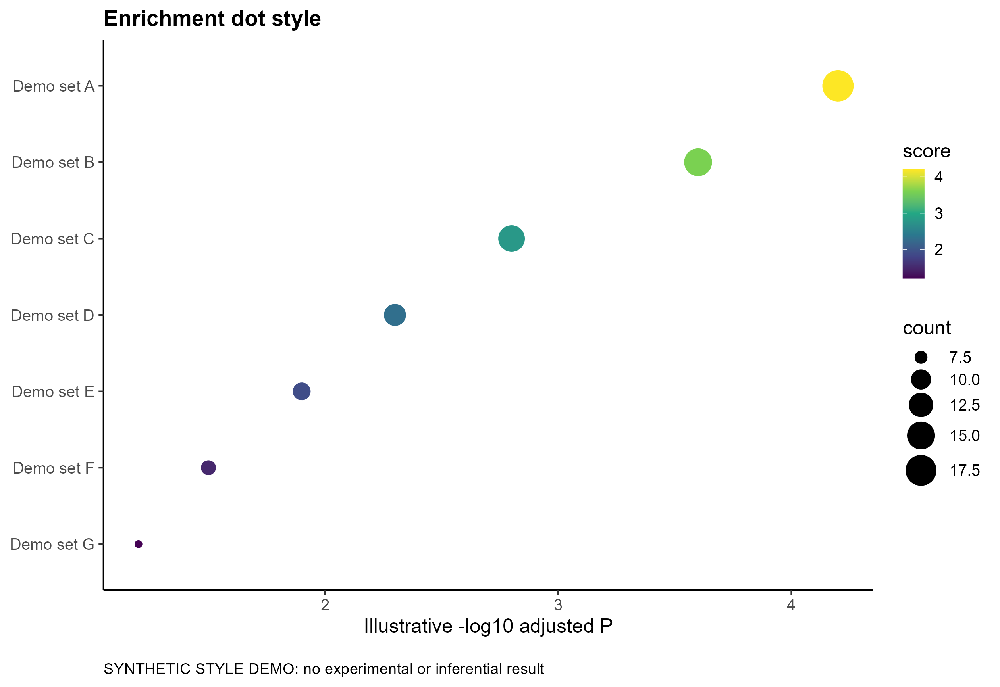](08_visualization/Enrichment/gallery/enrichment_dot_style_v1.png) | [绘图库](08_visualization/README.md) · [代码](scripts/generate_gallery.R) · [参数](08_visualization/Enrichment/gallery/enrichment_dot_style_v1.metadata.json) · [PDF](08_visualization/Enrichment/gallery/enrichment_dot_style_v1.pdf) | 渲染 PASS; **SYNTHETIC**; 演示资产 |
| `nes_heatmap_style_v1`<br>带方向的通路效应热图风格演示 | [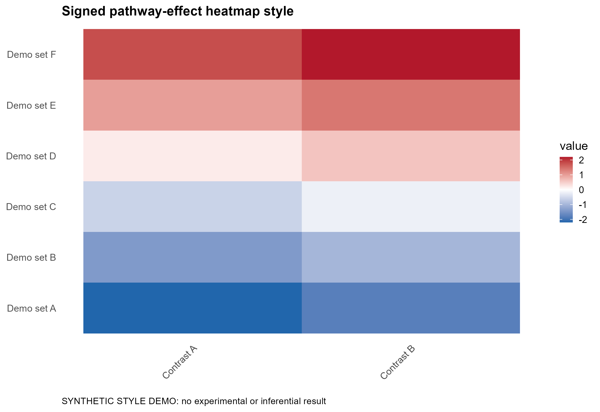](08_visualization/Enrichment/gallery/nes_heatmap_style_v1.png) | [绘图库](08_visualization/README.md) · [代码](scripts/generate_gallery.R) · [参数](08_visualization/Enrichment/gallery/nes_heatmap_style_v1.metadata.json) · [PDF](08_visualization/Enrichment/gallery/nes_heatmap_style_v1.pdf) | 渲染 PASS; **SYNTHETIC**; 演示资产 |

## 网络图风格

| Plot ID／用途 | 预览 | 方法／代码／参数／矢量图 | 状态与数据 |
|---|---|---|---|
| `alluvial_style_v1`<br>冲积图风格演示 | [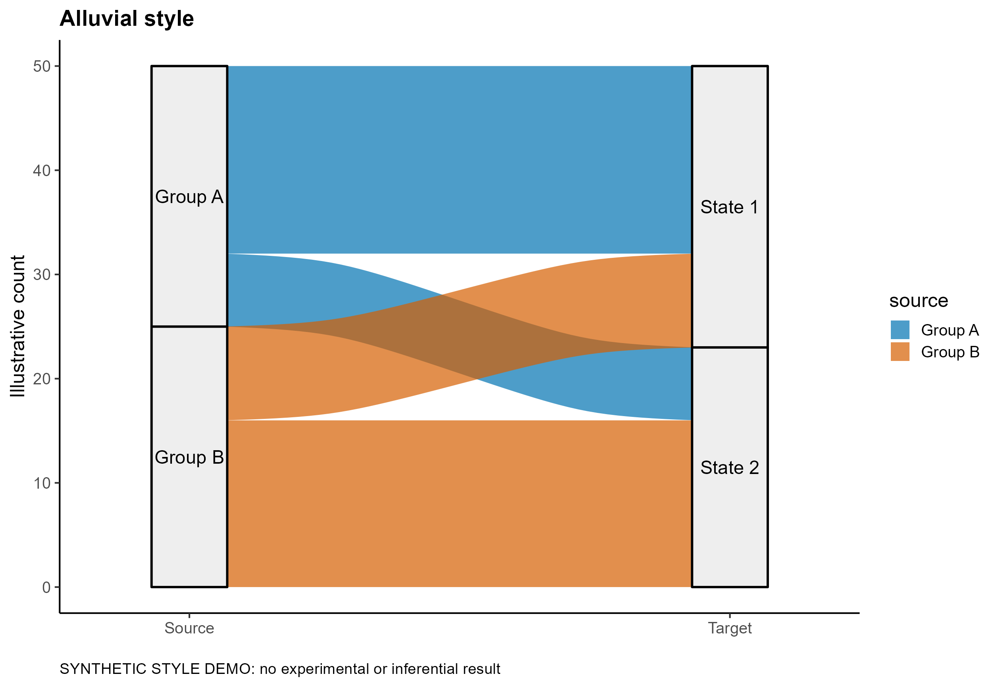](08_visualization/Sankey_Alluvial/gallery/alluvial_style_v1.png) | [绘图库](08_visualization/README.md) · [代码](scripts/generate_gallery.R) · [参数](08_visualization/Sankey_Alluvial/gallery/alluvial_style_v1.metadata.json) · [PDF](08_visualization/Sankey_Alluvial/gallery/alluvial_style_v1.pdf) | 渲染 PASS; **SYNTHETIC**; 演示资产 |
| `network_style_v1`<br>网络图风格演示 | [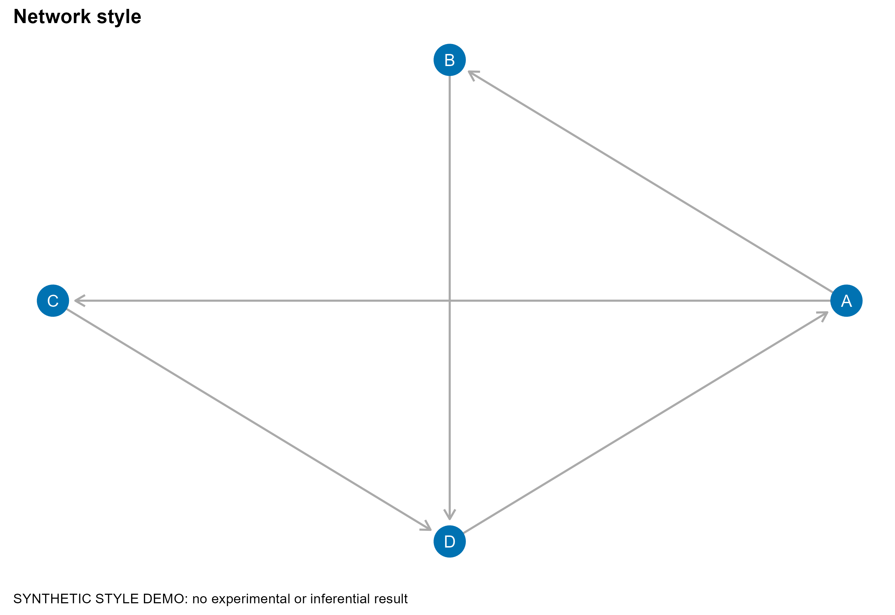](08_visualization/Network/gallery/network_style_v1.png) | [绘图库](08_visualization/README.md) · [代码](scripts/generate_gallery.R) · [参数](08_visualization/Network/gallery/network_style_v1.metadata.json) · [PDF](08_visualization/Network/gallery/network_style_v1.pdf) | 渲染 PASS; **SYNTHETIC**; 演示资产 |
| `chord_style_v1`<br>弦图风格演示 | [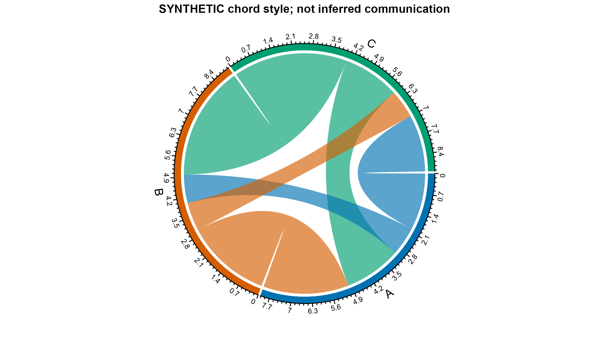](08_visualization/Circle_Chord/gallery/chord_style_v1.png) | [绘图库](08_visualization/README.md) · [代码](scripts/generate_gallery.R) · [参数](08_visualization/Circle_Chord/gallery/chord_style_v1.metadata.json) · [PDF](08_visualization/Circle_Chord/gallery/chord_style_v1.pdf) | 渲染 PASS; **SYNTHETIC**; 演示资产 |

## 生存分析

| Plot ID／用途 | 预览 | 方法／代码／参数／矢量图 | 状态与数据 |
|---|---|---|---|
| `survival_km_v1`<br>KM 生存曲线、置信区间与风险人数 | [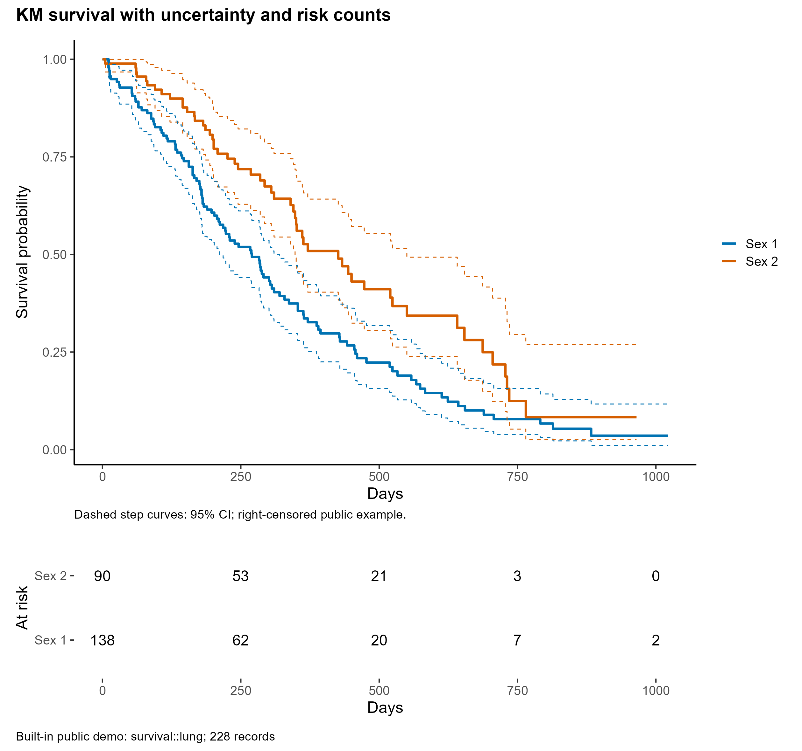](08_visualization/SurvivalPlot/gallery/survival_km_v1.png) | [方法](07_bulk_clinical_ml/survival/METHOD_CARD.md) · [代码](scripts/generate_gallery.R) · [参数](08_visualization/SurvivalPlot/gallery/survival_km_v1.metadata.json) · [PDF](08_visualization/SurvivalPlot/gallery/survival_km_v1.pdf) | 渲染 PASS; survival::lung; 228 条记录; 演示资产 |
| `forest_cox_v1`<br>风险比及 95% 置信区间 | [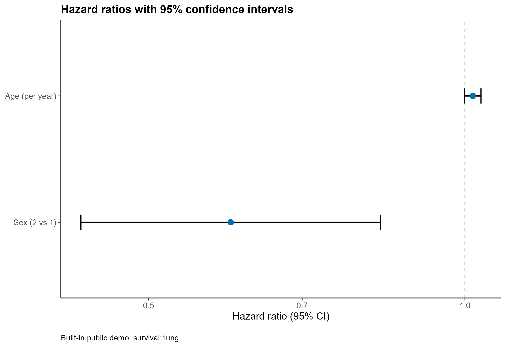](08_visualization/ForestPlot/gallery/forest_cox_v1.png) | [方法](07_bulk_clinical_ml/Cox/METHOD_CARD.md) · [代码](08_visualization/ForestPlot/forest_cox_v1.R) · [参数](08_visualization/ForestPlot/gallery/forest_cox_v1.metadata.json) · [PDF](08_visualization/ForestPlot/gallery/forest_cox_v1.pdf) | 渲染 PASS; survival::lung; CURRENT_DEFAULT |

## 机器学习

| Plot ID／用途 | 预览 | 方法／代码／参数／矢量图 | 状态与数据 |
|---|---|---|---|
| `roc_holdout_v1`<br>展示独立测试集的区分能力 | [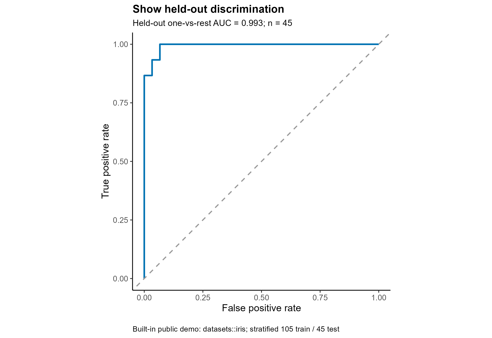](08_visualization/ROC/gallery/roc_holdout_v1.png) | [方法](07_bulk_clinical_ml/random_forest/METHOD_CARD.md) · [代码](scripts/generate_gallery.R) · [参数](08_visualization/ROC/gallery/roc_holdout_v1.metadata.json) · [PDF](08_visualization/ROC/gallery/roc_holdout_v1.pdf) | 渲染 PASS; datasets::iris; 分层划分：105 条训练／45 条测试; 演示资产 |

## 常用图形

| Plot ID／用途 | 预览 | 方法／代码／参数／矢量图 | 状态与数据 |
|---|---|---|---|
| `boxplot_iris_v1`<br>各物种中的观测值如何分布？ | [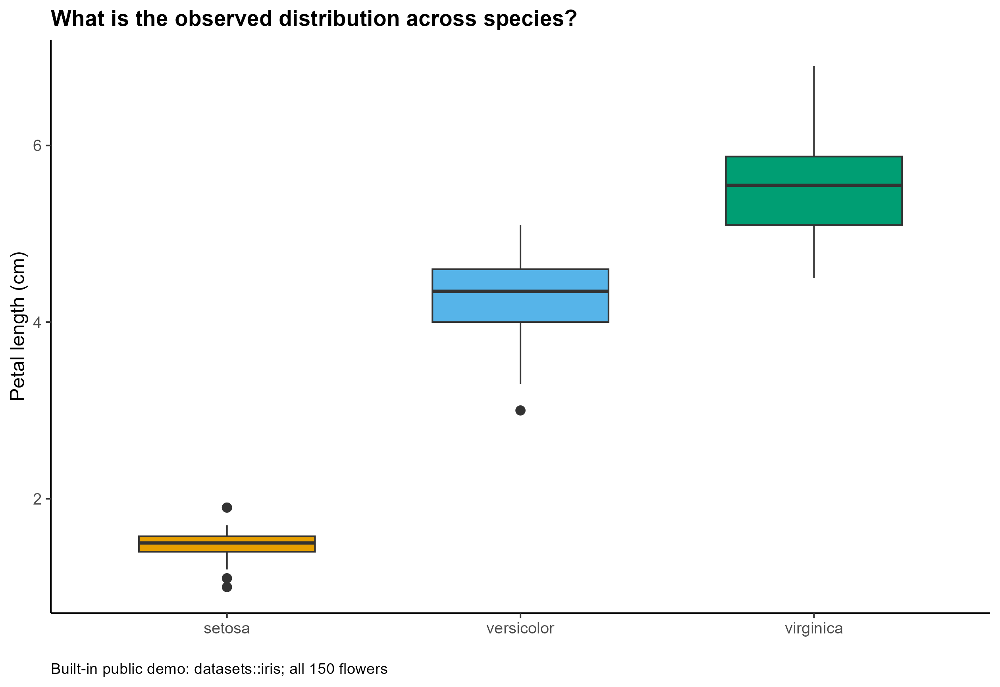](08_visualization/Boxplot/gallery/boxplot_iris_v1.png) | [绘图库](08_visualization/README.md) · [代码](scripts/generate_gallery.R) · [参数](08_visualization/Boxplot/gallery/boxplot_iris_v1.metadata.json) · [PDF](08_visualization/Boxplot/gallery/boxplot_iris_v1.pdf) | 渲染 PASS; datasets::iris; 全部 150 朵花; 演示资产 |
| `violin_iris_v1`<br>比较观测到的花部测量值 | [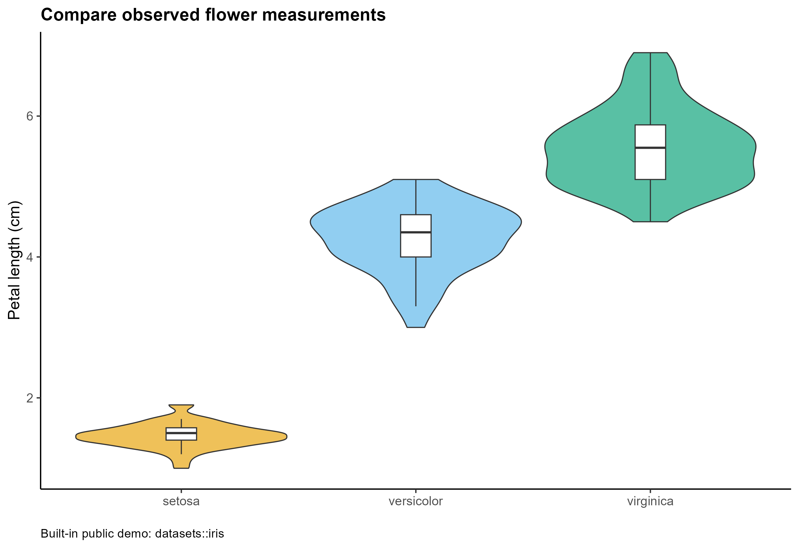](08_visualization/Violin/gallery/violin_iris_v1.png) | [绘图库](08_visualization/README.md) · [代码](scripts/generate_gallery.R) · [参数](08_visualization/Violin/gallery/violin_iris_v1.metadata.json) · [PDF](08_visualization/Violin/gallery/violin_iris_v1.pdf) | 渲染 PASS; datasets::iris; 演示资产 |
| `density_iris_v1`<br>测量值的密度如何不同？ | [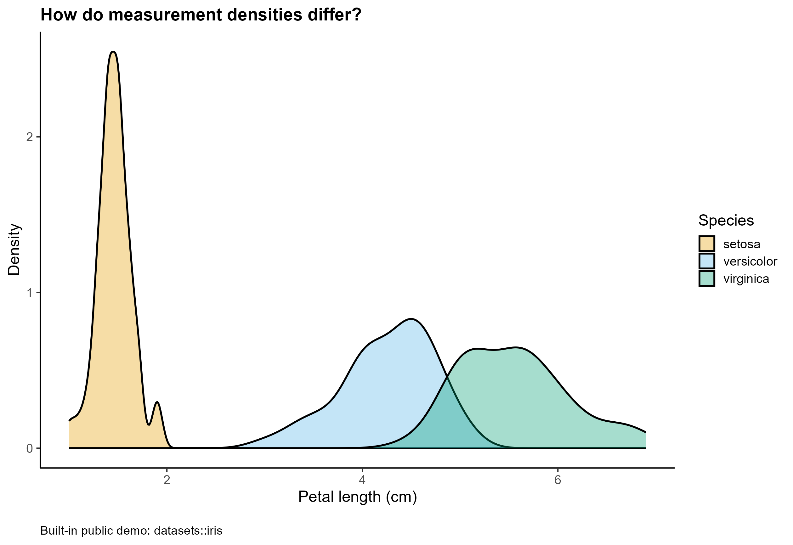](08_visualization/Density/gallery/density_iris_v1.png) | [绘图库](08_visualization/README.md) · [代码](scripts/generate_gallery.R) · [参数](08_visualization/Density/gallery/density_iris_v1.metadata.json) · [PDF](08_visualization/Density/gallery/density_iris_v1.pdf) | 渲染 PASS; datasets::iris; 演示资产 |
| `ridge_iris_v1`<br>按物种比较分布形状 | [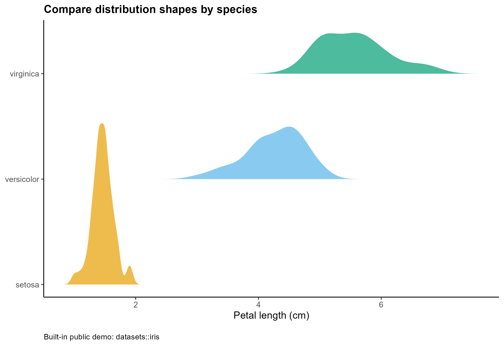](08_visualization/Ridge/gallery/ridge_iris_v1.png) | [绘图库](08_visualization/README.md) · [代码](scripts/generate_gallery.R) · [参数](08_visualization/Ridge/gallery/ridge_iris_v1.metadata.json) · [PDF](08_visualization/Ridge/gallery/ridge_iris_v1.pdf) | 渲染 PASS; datasets::iris; 演示资产 |
| `scatter_fit_v1`<br>展示线性关联及不确定性 | [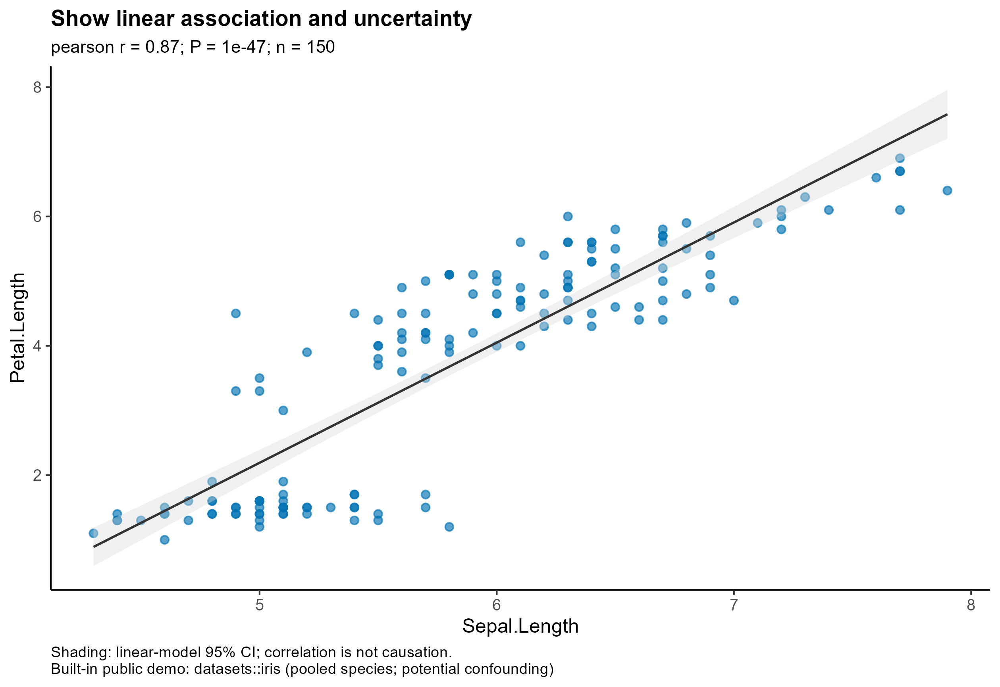](08_visualization/Scatter_Correlation/gallery/scatter_fit_v1.png) | [方法](07_bulk_clinical_ml/correlation/METHOD_CARD.md) · [代码](08_visualization/Scatter_Correlation/scatter_fit_v1.R) · [参数](08_visualization/Scatter_Correlation/gallery/scatter_fit_v1.metadata.json) · [PDF](08_visualization/Scatter_Correlation/gallery/scatter_fit_v1.pdf) | 渲染 PASS; datasets::iris (混合物种，可能存在混杂); CURRENT_DEFAULT |
| `density_scatter_v1`<br>观测值集中在哪里？ | [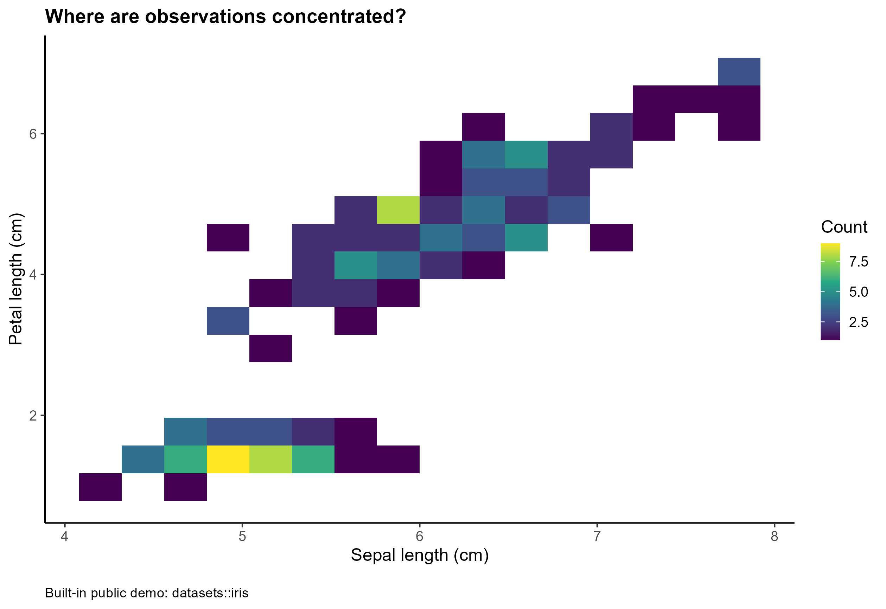](08_visualization/Scatter_Correlation/gallery/density_scatter_v1.png) | [绘图库](08_visualization/README.md) · [代码](scripts/generate_gallery.R) · [参数](08_visualization/Scatter_Correlation/gallery/density_scatter_v1.metadata.json) · [PDF](08_visualization/Scatter_Correlation/gallery/density_scatter_v1.pdf) | 渲染 PASS; datasets::iris; 演示资产 |
| `correlation_bh_heatmap_v1`<br>哪些关联通过指定的多重检验规则？ | [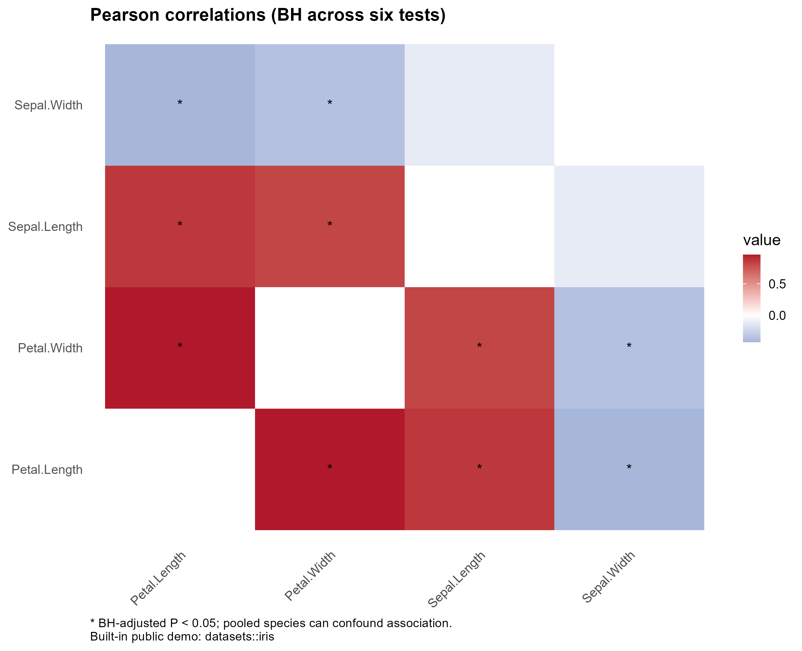](08_visualization/Scatter_Correlation/gallery/correlation_bh_heatmap_v1.png) | [方法](07_bulk_clinical_ml/correlation/METHOD_CARD.md) · [代码](scripts/generate_gallery.R) · [参数](08_visualization/Scatter_Correlation/gallery/correlation_bh_heatmap_v1.metadata.json) · [PDF](08_visualization/Scatter_Correlation/gallery/correlation_bh_heatmap_v1.pdf) | 渲染 PASS; datasets::iris; 演示资产 |
| `pairplot_iris_v1`<br>对照两组变量的关联 | [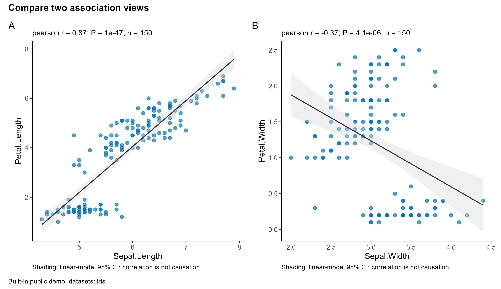](08_visualization/Scatter_Correlation/gallery/pairplot_iris_v1.png) | [绘图库](08_visualization/README.md) · [代码](scripts/generate_gallery.R) · [参数](08_visualization/Scatter_Correlation/gallery/pairplot_iris_v1.metadata.json) · [PDF](08_visualization/Scatter_Correlation/gallery/pairplot_iris_v1.pdf) | 渲染 PASS; datasets::iris; 演示资产 |
| `volcano_clean_v1`<br>火山图风格模板 | [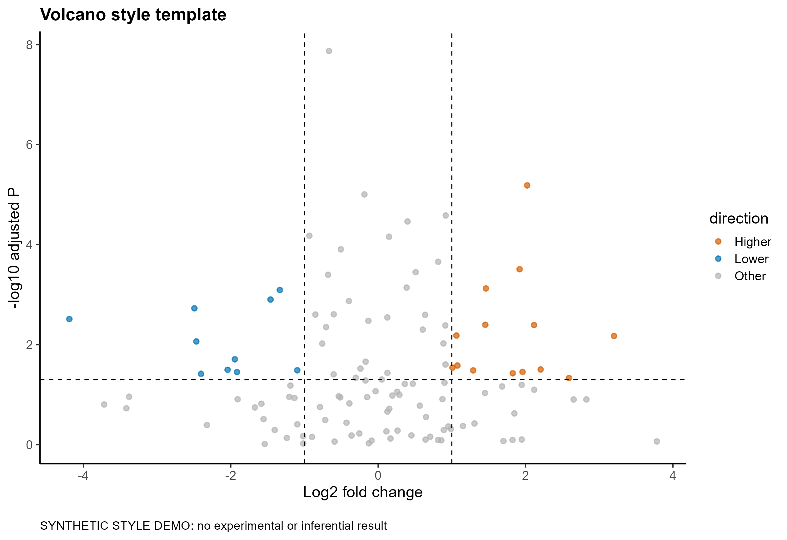](08_visualization/Volcano/gallery/volcano_clean_v1.png) | [绘图库](08_visualization/README.md) · [代码](08_visualization/Volcano/volcano_clean_v1.R) · [参数](08_visualization/Volcano/gallery/volcano_clean_v1.metadata.json) · [PDF](08_visualization/Volcano/gallery/volcano_clean_v1.pdf) | 渲染 PASS; **SYNTHETIC**; 演示资产 |
| `lollipop_style_v1`<br>排名棒棒糖图风格 | [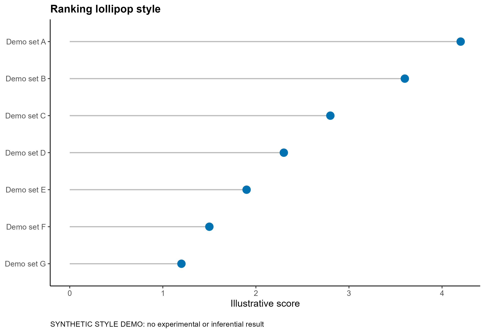](08_visualization/Lollipop/gallery/lollipop_style_v1.png) | [绘图库](08_visualization/README.md) · [代码](scripts/generate_gallery.R) · [参数](08_visualization/Lollipop/gallery/lollipop_style_v1.metadata.json) · [PDF](08_visualization/Lollipop/gallery/lollipop_style_v1.pdf) | 渲染 PASS; **SYNTHETIC**; 演示资产 |
| `waterfall_style_v1`<br>瀑布图风格演示 | [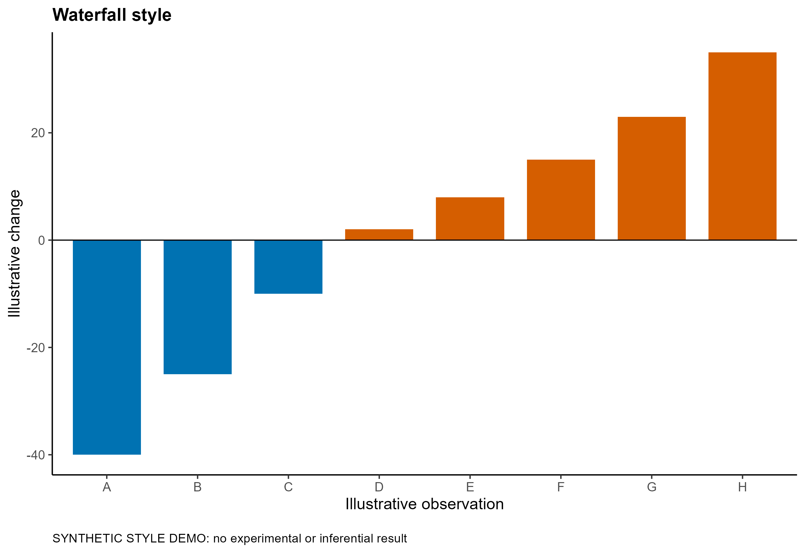](08_visualization/Waterfall/gallery/waterfall_style_v1.png) | [绘图库](08_visualization/README.md) · [代码](scripts/generate_gallery.R) · [参数](08_visualization/Waterfall/gallery/waterfall_style_v1.metadata.json) · [PDF](08_visualization/Waterfall/gallery/waterfall_style_v1.pdf) | 渲染 PASS; **SYNTHETIC**; 演示资产 |

## 科研示意图

| Plot ID／用途 | 预览 | 方法／代码／参数／矢量图 | 状态与数据 |
|---|---|---|---|
| `schematic_workflow_v1`<br>研究流程示意模板 | [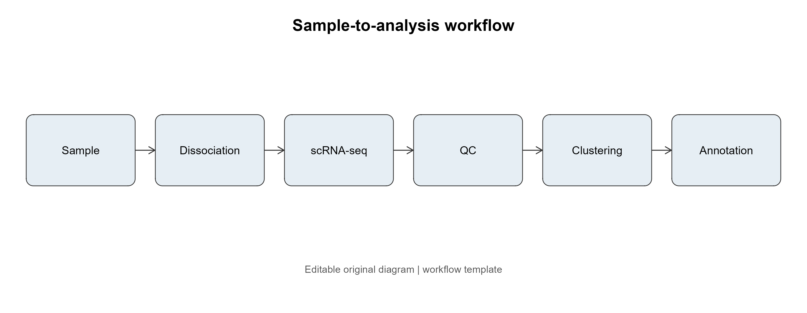](10_scientific_schematics/workflow_diagrams/gallery/schematic_workflow_v1.png) | [示意图](10_scientific_schematics/README.md) · [代码](10_scientific_schematics/workflow_diagrams/workflow_v1.R) · [参数](10_scientific_schematics/workflow_diagrams/gallery/schematic_workflow_v1.metadata.json) · [PDF](10_scientific_schematics/workflow_diagrams/gallery/schematic_workflow_v1.pdf) | 渲染 PASS; **SYNTHETIC**; 演示资产 |
| `schematic_cell_interaction_v1`<br>细胞相互作用假说模板 | [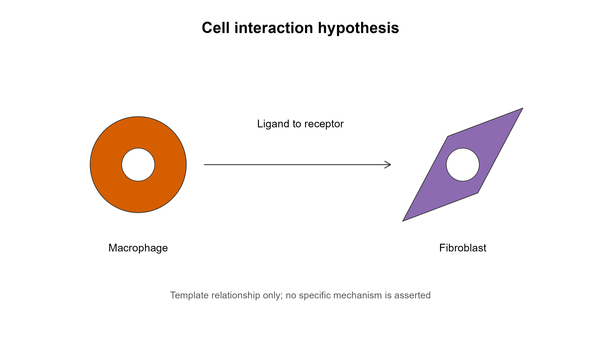](10_scientific_schematics/cell_interaction/gallery/schematic_cell_interaction_v1.png) | [示意图](10_scientific_schematics/README.md) · [代码](10_scientific_schematics/cell_interaction/cell_interaction_v1.R) · [参数](10_scientific_schematics/cell_interaction/gallery/schematic_cell_interaction_v1.metadata.json) · [PDF](10_scientific_schematics/cell_interaction/gallery/schematic_cell_interaction_v1.pdf) | 渲染 PASS; **SYNTHETIC**; 演示资产 |
| `schematic_mechanism_v1`<br>机制关系模板 | [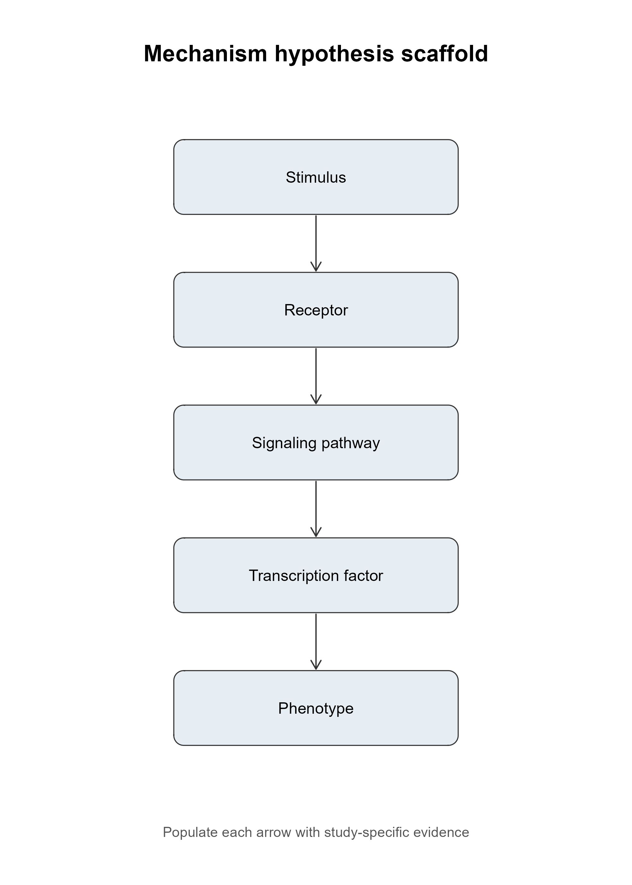](10_scientific_schematics/mechanism_diagrams/gallery/schematic_mechanism_v1.png) | [示意图](10_scientific_schematics/README.md) · [代码](10_scientific_schematics/mechanism_diagrams/mechanism_v1.R) · [参数](10_scientific_schematics/mechanism_diagrams/gallery/schematic_mechanism_v1.metadata.json) · [PDF](10_scientific_schematics/mechanism_diagrams/gallery/schematic_mechanism_v1.pdf) | 渲染 PASS; **SYNTHETIC**; 演示资产 |
| `schematic_components_v1`<br>可复用矢量组件 | [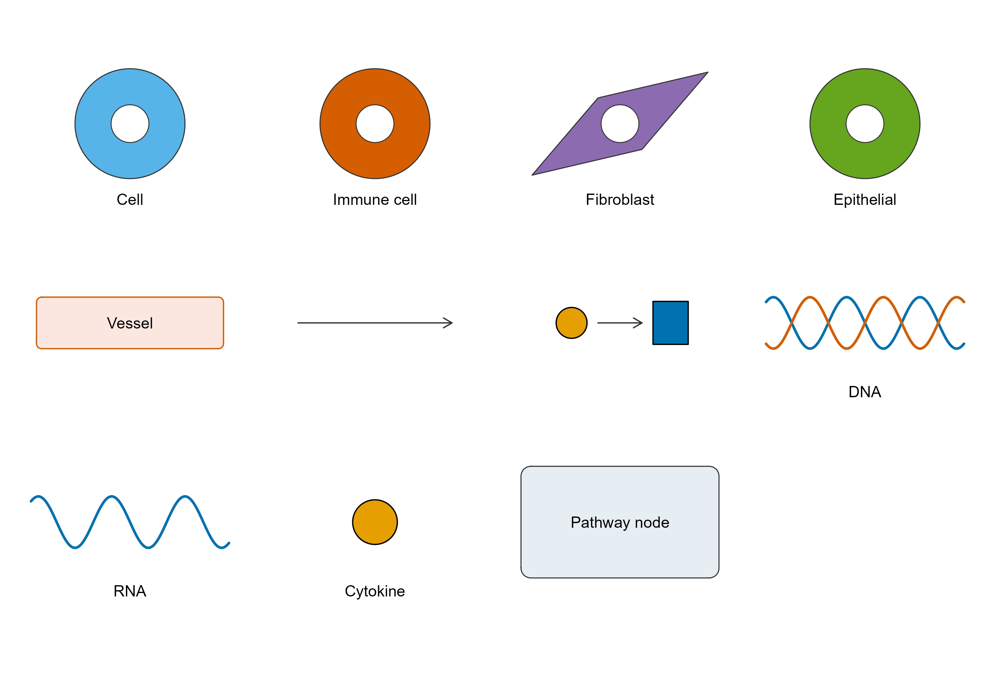](10_scientific_schematics/reusable_components/gallery/schematic_components_v1.png) | [示意图](10_scientific_schematics/README.md) · [代码](10_scientific_schematics/reusable_components/components.R) · [参数](10_scientific_schematics/reusable_components/gallery/schematic_components_v1.metadata.json) · [PDF](10_scientific_schematics/reusable_components/gallery/schematic_components_v1.pdf) | 渲染 PASS; **SYNTHETIC**; 演示资产 |

## 配色

| Plot ID／用途 | 预览 | 方法／代码／参数／矢量图 | 状态与数据 |
|---|---|---|---|
| `palette_swatches_v1`<br>配色参考色卡 | [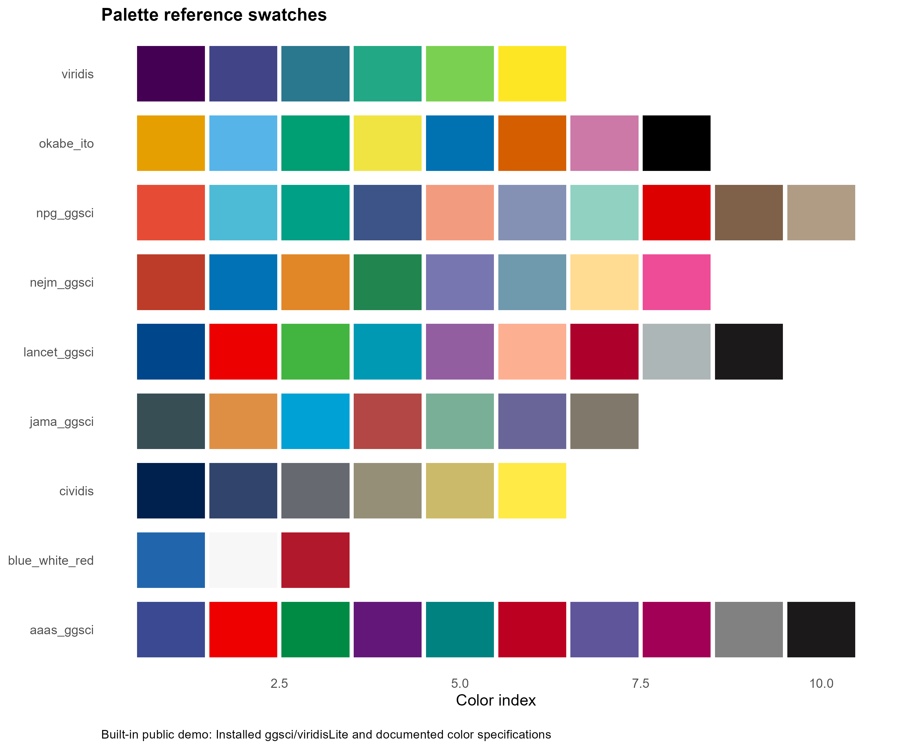](08_visualization/palettes/gallery/palette_swatches_v1.png) | [绘图库](08_visualization/README.md) · [代码](scripts/generate_gallery.R) · [参数](08_visualization/palettes/gallery/palette_swatches_v1.metadata.json) · [PDF](08_visualization/palettes/gallery/palette_swatches_v1.pdf) | 渲染 PASS; 已安装的 ggsci／viridisLite 与记录的颜色规范; 演示资产 |

## CellChat

原生推断与画廊为 **BLOCKED**，目前没有已生成原生预览。[35 项输出说明](04_cell_communication/CellChat/OUTPUT_CATALOG.md)链接整体／通路／配体受体网络、角色、模式和条件比较代码。计划中的图形输出路径为空，不能设为 `CURRENT_DEFAULT`。

## 轨迹／Monocle3

原生推断与画廊为 **BLOCKED**。[输出说明](03_cell_dynamics/monocle3/OUTPUT_CATALOG.md)记录 CDS、图结构、拟时序、表达／模块与可选 3D 输出。本画廊其他位置的合成网络或曲线不属于 Monocle3 分析结果。

## 重新生成示例与复用

```sh
Rscript scripts/smoke_tests.R
Rscript scripts/build_palettes.R
Rscript scripts/generate_gallery.R
Rscript scripts/generate_gallery.R umap_clean_v1
Rscript scripts/resolve_asset.R plot umap_clean_v1
```

在兼容环境中从仓库根目录运行。指定单个 Plot ID 只重新生成对应演示，仍需已有 smoke 数据和生成器加载的依赖；自己的数据应按登记函数的输入约定调用。上述 smoke、配色及画廊生成命令会更新现有验证记录、登记表和输出，日常查看不必执行。元数据保存在每个 PNG 旁，`registry/plots.yml` 是正式索引。推荐新图前应检查实际导出；原始输入、RDS 和大型数据不进入 Git。

两个并列 UMAP 不使用上述旧生成器，改用 `scripts/generate_umap_alternatives.R` 和真实本地坐标；完整准备、验证与运行顺序见 [UMAP 中文说明](08_visualization/UMAP/README.md)。旧生成器保留由独立生成器维护的登记项，不重画这两个图；旧图和默认选择保留。
