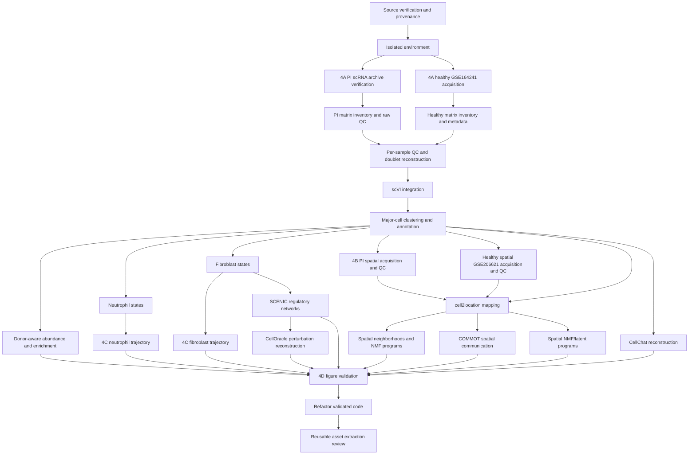

# Phase 4 Dependency Graph

## Execution rule

Only a module whose incoming evidence and data dependencies have passed validation may run. A failed optional branch does not invalidate independent branches, but no downstream module may silently substitute unavailable inputs.

## Gate definitions

| Gate | Required evidence | Blocks |
|---|---|---|
| A1 | Zenodo record resolved, archive MD5 verified | all PI scRNA analyses |
| A2 | Eight readable matrices; gene dimensions and per-sample cells recorded | QC/integration |
| A3 | QC/doublet choices and retained counts recorded by sample and donor | integration/statistics |
| A4 | scVI model diagnostics and stable embedding saved | annotation/spatial reference |
| A5 | marker-supported major labels and uncertainty flags | every cell-state/spatial module |
| B1/B2 | spatial counts, images and coordinates pass integrity checks | mapping/spatial statistics |
| B3 | cell2location fit diagnostics and spot-level abundance estimates | COMMOT/NMF/figure panels |
| module validation | output compared with the corresponding paper panel/conclusion | refactor/extraction |

## Module-to-paper map

| Module | Paper evidence target | Main input |
|---|---|---|
| Major-cell integration and abundance | Figure 1; Supplementary Figure 1 | PI + healthy scRNA counts and metadata |
| Spatial mapping and hotspots | Figure 2; Supplementary Figure 2 | PI/healthy Visium plus annotated scRNA reference |
| Neutrophil states | Figure 3; Supplementary Figure 3 | annotated neutrophil subset |
| Cell-cell communication | Figure 4; Supplementary Figure 4 | annotated cell states; spatial mapping for COMMOT |
| Fibroblast states and trajectory | Figure 5; Supplementary Figure 5 | annotated fibroblast subset |
| SCENIC / CellOracle | Figure 5 regulatory panels | fibroblast counts, clusters and trajectory |
| Experimental validation | Figures 3–6 experimental panels | unavailable wet-lab inputs; reference only |

Figure 6 is predominantly experimental and is not a computational reproduction target. Computational outputs may be compared with its biological model, without claiming reproduction of experiments.

